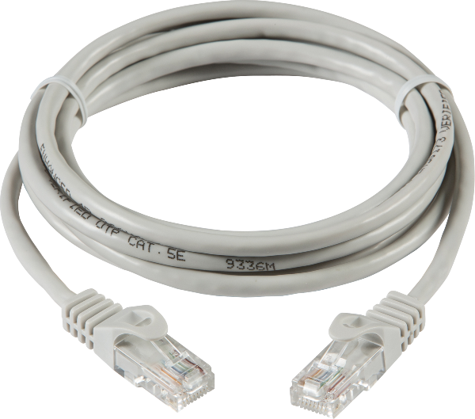
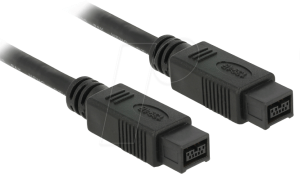
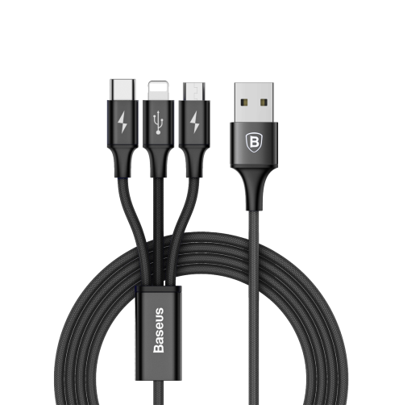
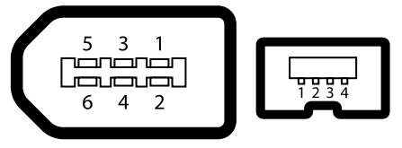
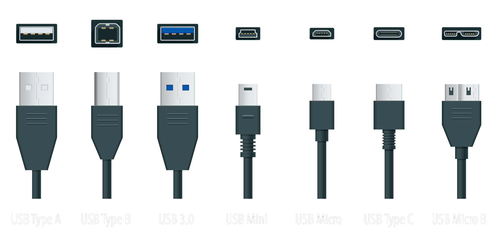
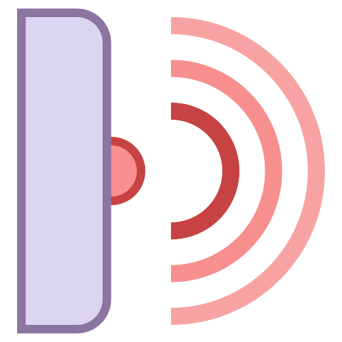
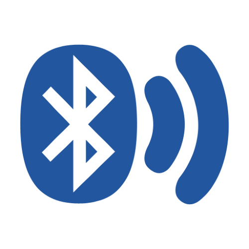
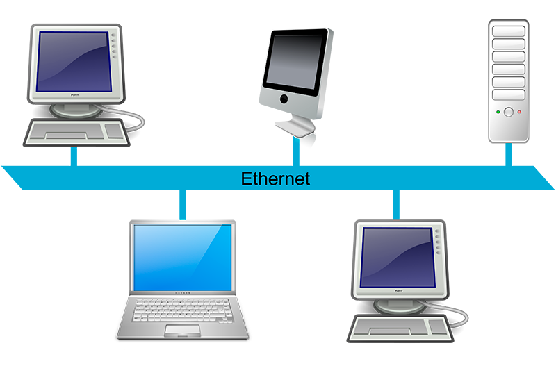
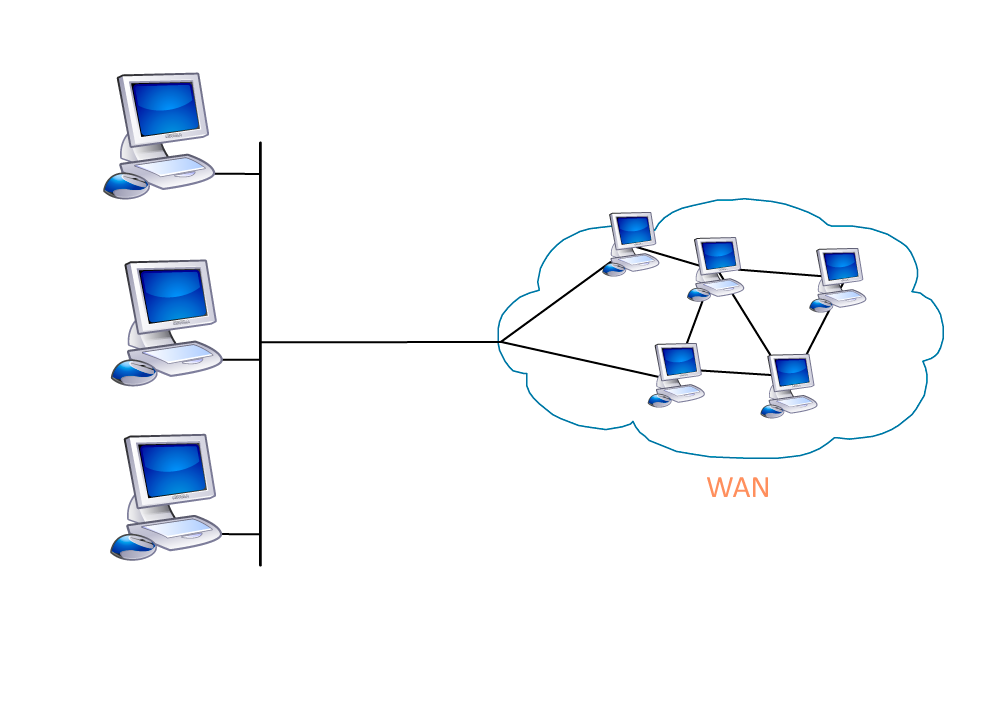

---
hide:
  - footer
---

# Información a través de la red

En este primer tema veremos lo que es una red de ordenadores, cómo se estructuran y sobretodo, cómo funciona ***Internet*** 👉 la red de redes.

## 🔠 ¿Que aprenderemos aquí?

Seremos capaces de diferenciar los distintos tipos de redes que existen en el mundo de la informática, cómo y para qué se utilizan, cómo están montadas estas redes a nivel de infraestructura y las más importantes en el día a día en el mundo laboral.

<figure markdown>
  { width="400" }
  <figcaption></figcaption>
</figure>

## 🔗 1.1 Tipos de redes informáticas

Existen diversos tipos de redes informáticas a lo largo y ancho del planeta, cada una de ellas con distintas características en función de las necesidades de las personas y los datos o archivos digitales.

### 🥖 Redes PAN (**P**ersonal **A**rea **N**etwork)

Las redes PAN o redes de área personal son las redes más básicas que existen para comunicar entre sí 2 dispositivos diferentes.

De esta manera, podemos intercambiar datos entre 2 aparatos de una manera fácil y rápida pero ¿cómo se conectan estos dispositivos?

<figure markdown>
  { width="300" }
  <figcaption></figcaption>
</figure>

#### Por cable

A lo largo de la historia se han ido creando diferentes tipos de cables con distintas conexiones, cables con tasas de transferencia de datos más rápidas que otras, mayor voltaje y demás características técnicas.

Como hemos visto anteriormente, estos cables hacen de puente entre un dispositivo y otro diferente, conectándose enter sí mediante protocolos de transferencia. Veamos un listado de tipos de cable para realizar esta conexión:

{ width="250" } | { width="250" } | { width="250" }
:---------:|:----------:|:---------:
 **Ethernet** | **FireWire** | **USB**

!!! DANGER "Ethernet ~ año 1972"
    Este estándar de conexión es de los más antiguos que existen a la hora de transferir archivos entre computadoras.

    Data del año 1972 creado por el ingeniero Robert Metcalfe en el Xerox Parc (Palo Alto, California) y las primeras conexiones se realizaban a través de un cable coaxial, totalmente diferente a lo que estamos acostumbrados a ver hoy en día.

    <figure markdown>
      { width="300" }
      <figcaption>Clavija y cable coaxial</figcaption>
    </figure>

!!! INFO "FireWire ~ año 1995"
    También conocido como **IEEE1394** es un protocolo de transferencia de archivos de alta velocidad. Está disponible para varios dispositivos digitales como ordenadores, cámaras digitales o videocámaras.

    Fue creado por **Apple Computers** en el año 1995 el cual lo incorporó en casi todos los modelos de ordenadores **Apple** llamados más comunmente **Macintosh**.

    <figure markdown>
      { width="300" }
      <figcaption>Clavijas FireWire de 6 y 4 pines</figcaption>
    </figure>

!!! EXAMPLE "USB ~ año 1996"
    Sus siglas vienen del nombre completo ***Universal Serial Bus*** o como diríamos en castellano **Bus Universal en Serie** es un bus estándar que define los cables, conectores y protocolos de trasnferencia de archivos entre dispositivos.

    Todo surgió de la idea de unificar y universalizar todas las conexiones de todos los dispositivos que existen y así tener una mayor estandarización en todos los aparatos electrónicos.

    Creado en el año 1996 bajo la empresa **Intel** sustituyendo al Puerto serie, puerto paralelo, puerto de juegos(antiguos COM1 y COM2), Apple Desktop Bus y PS/2 (teclados y ratones).

    <figure markdown>
      { width="300" }
      <figcaption>Puertos USB</figcaption>
    </figure>

#### Inalámbrica

Las redes inalámbricas son famosas por no necesitar de un cable físico para interconectar 2 dispositivos diferentes. A través de diferentes protocolos podemos establecer conexiones e intercambiar datos de una maquina a otra.

##### IrDA

<figure markdown>
  { width="150" }
  <figcaption></figcaption>
</figure>

Esta tecnología conocida como IrDA (**I**nfra**r**ed **D**ata **A**ssociation) hace uso de los rayos infrarrojos para transferir datos entre 2 dispositivos diferentes a muy corta distancia (entre los 0,2 y 1 metro de distancia) y con un ángulo máximo de de 15°.

La velocidad máxima de transferencia oscila enter los 9600 bits/s hasta los 4Mbits/s.

Fue creada en el año 1993 por diferentes empresas de tales como **HP**, **IBM**, **Sharp** entre otros fabricantes.

!!! INFO
    Esta tecnología venía preinstalada en ordenadores y teléfonos móviles NOKIA a finales de los años 90 y principios de los 2000. Más adelante, distintas marcas como **Samsung** y **Motorola** incorporaban estos dispositivos en sus terminales.

##### Bluetooth

<figure markdown>
  { width="300" }
  <figcaption></figcaption>
</figure>

##### Wireless

- IrDA
- Bluetooth (Piconet)
- Wireless (Wi-Fi o Wireless Fidelity)

### 📶 Redes LAN (**L**ocal **A**rea **N**etwork)

<figure markdown>
  { width="300" }
  <figcaption></figcaption>
</figure>

Una red de área local o LAN (por las siglas en inglés local area network) es una red de computadoras que permite la comunicación y el intercambio de datos entre diferentes dispositivos a nivel local, ya que está limitada a distancias cortas. Por esta razón, esta red se utiliza para hogares privados, tales como una casa o un apartamento, y en empresas.

### 🏢 Redes MAN (**M**etropolitan **A**rea **N**etwork)

Una red de área metropolitana (MAN, Metropolitan Area Network) es una red de alta velocidad (banda ancha) que da cobertura en un área geográfica extensa, proporcionando capacidad de integración de múltiples servicios mediante la transmisión de datos, voz y vídeo, sobre medios de transmisión tales como fibra óptica y par trenzado (MAN Bucle).​ La tecnología de pares de cobre se posiciona como la red más grande del mundo una excelente alternativa para la creación de redes metropolitanas, por su baja latencia (entre 1 y 50 milisegundos), gran estabilidad y la carencia de interferencias radioeléctricas, las redes MAN BUCLE, ofrecen velocidades de 10 Mbit/s o 20 Mbit/s, sobre pares de cobre y 100 Mbit/s, 1 Gbit/s y 10 Gbit/s mediante fibra óptica.

### 🚠 Redes WAN (**W**ide **A**rea **N**etwork)

<figure markdown>
  { width="500" }
  <figcaption></figcaption>
</figure>

Una red de área amplia, o WAN (wide area network en inglés), es una red de computadoras que une e interconecta varias redes de ámbito geográfico menor, por ejemplo redes de área local, aunque sus miembros no estén todos en una misma ubicación física. Muchas WAN son construidas por organizaciones o empresas para su uso privado, otras son instaladas por los proveedores de Internet (ISP) para proveer conexión a sus clientes.

Hoy en día, internet brinda conexiones de alta velocidad, de manera que un alto porcentaje de las redes WAN se basan en ese medio, reduciendo la necesidad de redes privadas WAN, mientras que las redes privadas virtuales que utilizan cifrado y otras técnicas para generar una red dedicada sobre comunicaciones en Internet, aumentan continuamente.

### 🌎 Redes GAN (**G**loabal **A**rea **N**etwork)

Una red global como Internet recibe el nombre de Global Area Network (GAN), sin embargo no es la única red de ordenadores de esta índole. Las empresas que también son activas a nivel internacional mantienen redes aisladas que comprenden varias redes WAN y que logran, así, la comunicación entre los ordenadores de las empresas a nivel mundial. Las redes GAN utilizan la infraestructura de fibra de vidrio de las redes de área amplia (Wide Area Networks) y las agrupan mediante cables submarinos internacionales o transmisión por satélite.

### 🔏 Redes VPN (**V**irtual **P**rivate **N**etwork)

<figure markdown>
  { width="500" }
  <figcaption></figcaption>
</figure>

Una red privada virtual (VPN) es una red de comunicación virtual que utiliza la infraestructura de una red física para asociar sistemas informáticos de manera lógica. En este sentido, se puede tratar de todos los tipos de redes expuestos anteriormente. Lo más común es utilizar Internet como medio de transporte, ya que este permite establecer la conexión entre todos los ordenadores a nivel mundial y, al contrario de lo que ocurre con las redes MAN o WAN privadas, está disponible de forma gratuita. La transferencia de datos tiene lugar dentro de un túnel virtual erigido entre un cliente VPN y un servidor VPN.

Si se utiliza la red pública como medio de transporte, las Virtual Private Networks o redes privadas virtuales suelen cifrarse para garantizar la confidencialidad de los datos. Las VPN se emplean para conectar redes LAN en Internet o para hacer posible el acceso remoto a una red o a un único ordenador a través de la conexión pública.

---

## 🔍 1.2 Búsqueda a través de la red

<figure markdown>
  { width="300" }
  <figcaption></figcaption>
</figure>

A lo largo y ancho de toda la red existe un sinfín de información que puede ser visitada a través del navegador per ¿cómo se indexa tal cantidad de datos?

Los buscadores en la red son los encargados de indexar todo tipo de información que esté alojada en cualquier servidor de Internet, siempre y cuando se cumplan ciertas características, para que el usuario pueda encontrarlo de una manera fácil y rápida. Digamos que es como una biblioteca casi infinita de contenido digital.

Dentro de los buscadores podemos encontrar 3 tipos de diferentes.

## 👺 Buscadores temáticos

Son aquellos que realizan búsquedas de contenido digital en función a una temática o categoría en específico. Como cuando en una red social tipo Instagram, Twitter, Tiktok o Facebook usamos los _hastags_ para indexar lo que publicamos bajo esa o esas categorías.

### [WORder](https://es.worder.cat/buscarpalabras){target="_blank"}

Se trata de un buscador de palabras para pasatiempos y juegos como crucigramas, el ahorcado y de tipo Scrabble. También puede buscar palabras que riman con otras. 

### [EveryPixel](https://www.everypixel.com/){target="_blank"}

Buscador de imágenes de alta calidad en más de 50 bancos de imágenes de la red. Dispone de potentes filtros para ajustar nuestras búsquedas y encontrar solo los resultados que nos interesan.

### [Buscador de recetas](http://buscador-de-recetas.com/){target="_blank"}

Si quieres convertirte en un auténtico chef, o al menos preparar algunos platos sabrosos, seguro que te interesa este buscador con más de 326000 recetas de cocina recopiladas de más de 1000 blogs.

### [GIPHY](https://giphy.com/){target="_blank"}

Se trata de uno de los buscadores temáticos más populares, posiblemente ya lo conocías, especializado en la búsqueda de gifs animados. Su base de datos es sencillamente impresionante.

## 🏁 Motores de búsqueda

Sin duda alguna los más populares en la actualidad ya que esto nos permiten obtener resultados de búsqueda basado en lo escrito por nosotros, estos funcionan mediante bases de datos que funcionan automáticamente e incorporan webs de casi cualquier tipo mediante el uso de robots los cuales viajan por la red rastreando sitios web, estos programas también los llaman «araña» o «motor» y este programa visita página por página y va creando bases de datos que se relacionen con la pagina.

### [Google](https://www.google.es/){target="_blank"}

El buscador de Google o buscador web de Google (en inglés Google Search) es un motor de búsqueda en la web propiedad de Alphabet Inc. Es el motor de búsqueda más utilizado en la Web​ y recibe cientos de millones de consultas cada día a través de sus diferentes servicios.​ El objetivo principal del buscador de Google es buscar texto en las páginas web, en lugar de otro tipo de datos. Fue desarrollado originalmente por Larry Page y Sergey Brin en 1997.

El buscador de Google proporciona al menos 22 características especiales más allá de la palabra original, entre ellas sinónimos, previsiones meteorológicas, zonas horarias, cotizaciones de bolsa, mapas, datos sobre terremotos, cartelera de cine, información de aeropuertos, listas de inicio y resultados deportivos. Hay funciones especiales para los números, incluyendo intervalos (70.. 73), precios, temperaturas, conversiones de unidades y de monedas ("10,5 cm en pulgadas"), cálculos ("3 * 4 + sqrt (6)-pi / 2"), seguimiento de paquetes, patentes, códigos de área telefónico, y traducción de páginas mostradas.

### [DuckDuckGo](https://www.duckduckgo.com/){target="_blank"}

DuckDuckGo (DDG) es un motor de búsqueda que hace hincapié en la protección de la privacidad de los buscadores y en evitar la burbuja de filtros de los resultados de búsqueda personalizados.​ DuckDuckGo no muestra resultados de búsqueda procedentes de granjas de contenido.​ Utiliza varias API de otros sitios web para mostrar resultados rápidos a las consultas y para los enlaces tradicionales utiliza la ayuda de sus socios (principalmente Bing) y su propio rastreador.4

La empresa tiene su sede en Paoli, Pensilvania, Estados Unidos, y contaba con 149 empleados en octubre de 2021.​ El nombre de la empresa es una referencia al juego infantil llamado, en idioma inglés, Duck, Duck, Goose (Pato, pato, Ganso)

### [Ecosia](https://www.ecosia.org/){target="_blank"}

Ecosia es un motor de búsqueda en Internet con sede en Berlín, Alemania que dona aproximadamente el 80 % de los ingresos que recibe a diferentes organizaciones sin ánimo de lucro de todo el mundo relacionadas con la reforestación.​ Tiene el objetivo de plantar mil millones de árboles antes de 2025. ​Es una empresa no sólo neutra en carbono​ sino que desde 2020 tiene huella de carbono negativa, puesto que produce el doble de la energía renovable que necesita para funcionar.​ Desde enero de 2014 es una empresa certificada B-Lab.

Además del buscador, Ecosia ofrece un navegador web para dispositivos Apple usando el motor WebKit y para Android usando Blink.

### [Bing](https://www.bing.com/){target="_blank"}

El buscador Bing es de Microsoft, y es uno de los más importantes en todo el mundo según su cuota de mercado. A diferencia de Google, con fondo blanco y la sencilla barra de búsqueda, Bing se muestra con un colorido fondo que va cambiando y, además, cuenta en la parte inferior con una barra de contenidos de actualidad que pueden ser relevantes para nosotros.

Por otro lado, en la parte superior tiene una barra que permite alternar entre la búsqueda típica o centrarse en imágenes, vídeos, mapas y noticias entre otros. Bing tiene sus propias funciones que lo diferencian de Google como, por ejemplo, traductor de textos o comprobación de gramática. La página de resultados, sin embargo, es casi idéntica a la que nos ofrece la compañía de Mountain View con su buscador Google.

### [Yahoo Search](https://es.search.yahoo.com/){target="_blank"}

Con Yahoo Search los resultados no van a ser específicos, sino que son cedidos por **Bing**, luego no va a darnos una experiencia diferente por sus páginas de resultados.

En cuanto al cuidado de la privacidad, no está al nivel de DuckDuckGo, pero sí que respeta en mayor medida la información de sus usuarios que Google. Y del mismo modo que la compañía de Mountain View nos ofrece resultados especiales para conocer la previsión meteorológica, o para conocer los horarios comerciales de negocios que estén cerca de nosotros. Así que, aunque no es tan completo como Google por la variedad de servicios añadidos, es algo más respetuoso y sigue manteniendo algunas de las funciones avanzadas más interesantes.

## ☄️ Metabuscadores

Un metabuscador es un sistema que localiza información en los motores de búsqueda más usados, carece de base de datos propia, por lo que usa las de otros buscadores y muestra una combinación de las mejores páginas que ha devuelto cada uno,​ de una sola vez y desde un solo punto.2

Un buscador normal recopila la información de las páginas mediante su indexación, como Google o bien mantiene un amplio directorio temático, como Yahoo!. La definición simplista sería que un metabuscador es un buscador en buscadores. Además, una vez realizada la búsqueda, los resultados pueden ser refinados hasta dar con la información más útil.

## EJERCICIOS

1. Realiza una búsqueda por Internet de los diferentes tipos de red de ordenadores que existen y escribe en un documento las propiedades más significativas de cada una de ellas, incluyendo cuándo se creó y quién la creo. El documento debe recoger las siguientes redes:
    - LAN
    - MAN
    - PAN
    - VPN
    - WAN

2. Te han pedido que conectes 4 ordenadores entre sí, mediante cable, para poder intercambiar archivos y carpetas con el mismo sistema operativo. Ten en cuenta que ninguno de los 4 ordenadres _**DEBE SALIR A INTERNET**_. Elabora un documento PDF con un esquema que contenga todos los elementos necesarios (tanto físicos como protocolos) para realizar dicha tarea y una breve descripción de lo que tendrías que hacer a nivel infraestructural. Puedes utilizar canva para hacer el esquema. A este archivo PDF llámalo **Ejercicio-1-2.pdf** y envíalo.

3. Haz lo mismo que en el ejercicio anterior pero creando una red SIN CABLES, utilizando el protocolo WI-FI y esta vez _**SI QUE DEBEN PODER SALIR A INTERNET**_.

4. Te has comprado un pendrive de 4GB de tamaño y una tasa de transferencia de 2Mb/s ¿Cuánto tiempo tardará el sistema en llenar el dispositivo? Calcula el tiempo en minutos y explica el proceso realizado.

5. Haz una búsqueda de Internet sobre el término o términos que quieras y compara los resultados en, al menos, 3 buscadores diferentes y explica las diferencias que encuentras; tanto en posición del mismo resultado (la misma web), descripción, título, interfraz gráfica y por último, la sensación que te da al buscar en dicho servidor. Añade cuál de todos ellos te gusta más y por qué.

6. Haz una búsqueda de al menos 10 **metabuscadores** de diferentes tipos (puedes repetir) que encuentres por Internet y comenta un poco su historia, cómo utilizarlo y a qué usuari@s va dirigido.

7. Realiza un documento con información acerca de programas P2P (Peer To Perr) con al menos 8 de ellos que estén especializados en lo siguiente:

    - Música
    - Películas
    - Archivos en general

!!! INFO "Formato del documento"
    **Nombre del programa**  
    Descripción del programa, lo que hace, quién lo creo y cuándo ¿se sigue utilizando? 
    Una foto de su logotipo