---
hide:
  - footer
---

# Comunicaciones internas y externas

En este segundo tema veremos las distintas maneras que tenemos de comunicarnos con otras personas utilizando las distintas tecnologías que existen.

## 🔠 ¿Que aprenderemos aquí?

Aprenderemos a utilizar las diferentes herramientas (o software) que se utilizan día a día para realizar comunicaciones, tanto internas como externas, gracias al poder de Internet y las nuevas tecnologías.

<figure markdown>
  { width="400" }
  <figcaption></figcaption>
</figure>

## 📧 Mensajes Internos y externos

Cuando hablamos de enviar mensajes, a día de hoy pensamos en mandar cierto texto a través del _Wahtsapp_, _Telegram_ o cualquier otra herramienta pero, ¿sabemos realmente si se trata de un mensaje interno o es más bien un mensaje externo?

### 🏠 Mensaje Interno
<figure markdown>
  { width="200" }
  <figcaption></figcaption>
</figure>

Un mensaje interno, en términos de informática, es cuando se envía un mensaje o notificación a traves de una red de la cual forman parte ciertos ordenadores (o máquinas) como en una red LAN, WLAN u otras.

!!! DANGER "Recuerda"
    En el primer tema vimos varios tipos de redes informáticas, algunas eran capaces de salir a Internet y otras no

Dicho mensaje puede enviarse a través de la red en forma de e-mail, a través de la consola, utilizando un chat empresarial.

Pero ¿qué pasa si trabajo en una oficina que opera a nivel global?

Por motivos de seguridad, no todos los ordenadores que se contectan a la misma red pueden enviarse mensajes unos a otros. En versiones antiguas de ciertos sistemas operativos, como Windows XP esta opción estaba activada por defecto pudiendo enviar mensajes a través del a IP interna de otros ordenadores.

### 🌐 Mensaje Externo
<figure markdown>
  { width="200" }
  <figcaption></figcaption>
</figure>

Cuando envíamos un mensaje de manera externa, quiere decir que el destino de ese mensaje se encuentra fuera de nuestra red local o empresarial. Es decir, cuando envíamos un e-mail desde nuestra cuenta de **Gmail** a nuestro amigo Juan que tiene una cuenta de correo en **Yahoo**, estamos enviando un mensaje un servidor o una red diferente a la nuestra puesto Gmail y Yahoo son servidores diferentes que se conectan entre sí a través de Internet.

### 🖨️ Mensajes Internos y Externos entre dispositivos
<figure markdown>
  { width="200" }
  <figcaption></figcaption>
</figure>

Ahora que sabemos diferenciar bien un mensaje interno de otro externo, debemos entender que NO sólo se pueden enviar mensajes o datos entre ordenadores (PC o Mac) sino entre todo tipo de dispositivos.

Ejemplo de mensaje Interno ➡️ en una red LAN entre un PC y una impresora.<br>
Ejemplo de mensaje Externo ➡️ en una red VPN entre un PC y una cámara de vigilancia.


## 📩 El Correo electrónico
<figure markdown>
  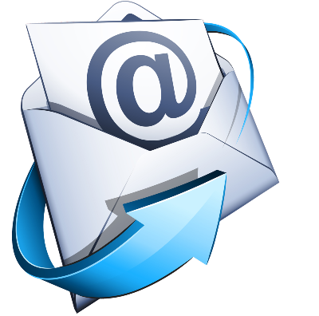{ width="200" }
  <figcaption></figcaption>
</figure>

Gracias al correo electrónico podemos comunicarnos con cualquier persona de cualquier parte del mundo en muy pocos segundos. Con tan sólo abrir nuestro **cliente de correo** favorito, conocer la dirección de correo del destinatario y unas cuantas palabras, podemos establecer una comunicación con alguien que vivie a muchos kilómetros de distancia de nosotros.

### 📋 Un poco de historia

El ***e-mail*** o correo electrónico, es un servicio de mensajería de Internet, por lo general gratuito, con el cual los usuarios pueden comunicarse con otras personas a través de mensajes de texto plano, texto maquetado con imágenes y estilos o la posibilidad de enviar archivos adjuntos.

Por muy raro que parezca, el correo electrónico es **anterior** a *Internet*

!!! DANGER "Ejercicio 6"
    Mírate el ejercicio 6 e investiga sobre la historia del ***e-mail***

### ✏️ Componiendo un mensaje de correo

<figure markdown>
  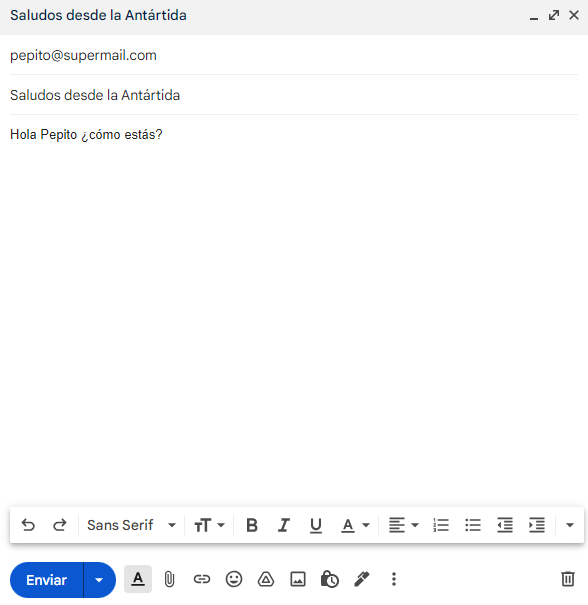{ width="500" }
  <figcaption>Enviando un correo desde GMail</figcaption>
</figure>

Para componer un mensaje de correo electrónico debemos utilizar un **cliente de correo** o utilizar el servicio ***webmail*** que nos proporciona nuestro servidor a través de su página web.

Una vez dentro del sistema para enviar correos podremos ver una interfaz de usuario, como la de la imagen de arriba, donde podremos especificar la siguiente información relacionada con el mensaje que queremos enviar:

- **Asunto**: En este campo pondremos una frase que resuma el contenido del mensaje que vayamos a enviar. Normalmente está limitado en unos 120 caracteres aproximadamente, dependiendo del servidor que utilicemos.
!!! WARNING
    Cuidado con el asunto que pongamos, ya que el filtro de *spam* de los servidores de correo trabaja en este campo

- **Destinatari@(s)**: Puede ser 1 o más personas que vayan a recibir el mismo correo, para ello pondremos las direcciones de correo electrónico separadas por punto y coma (y un espacio en planco si queremos) <br>
➡️ pepito@protonmail.com; juanita@gmail.com; alfredo@outlook.com

!!! DANGER
    Al poner todos los correos, todos los destinatarios podrán ver las direcciones de correo de todos las personas que van a recibir el mensaje, lo que puede considerarse una violación de datos personales.

- **CC**: **C**opia de **C**arboncillo, sirve para añadir destinatarios al correo electrónico pero verán que el mensaje irá dirigido a una única persona que es la que aparece en el campo **Destinatario**.

- **CCO**: **C**opia de **C**arboncillo **O**culta: Es lo mismo que **CC** pero los correos que se pongan en el campo **CCO** no aparecerán en la lista de destinatarios aunque si que recibirán el mismo mensaje que el resto de personas.

!!! DANGER "Ejemplo"
    👩‍🦰Ana escribe un correo electrónico a 💁‍♀️Beatriz (su profesora), para enviarle un trabajo. Sus compañeros de grupo, 👨‍🦱Carlos y 👦David, quieren recibir una copia del mensaje como comprobante de que se ha enviado correctamente, así que les incluye en el campo **CC**.
    
    Por último, sabe que a su hermano 🙅‍♂️Esteban también le gustaría ver este trabajo aunque no forma parte del grupo, así que le incluye en el campo **CCO** para que reciba una copia sin que los demás se enteren.


### 🛠️ ¿Cómo funciona el *e-mail*?
<figure markdown>
  { width="300" }
  <figcaption></figcaption>
</figure>

Cuando abrimos nuestro correo (o cliente de correo) vemos una serie de carpetas u opciones de clasificación de nuestra cuenta, así como de numerosas opciones para interactuar con ellas. Veamos cada una de las partes.

#### 📥 Bandeja de entrada ~ Inbox

La bandeja de entrada es el lugar donde se almacenan todos los correos que recibimos. Cuando alguien nos envía un mensaje aparecerá en la bandeja de entrada y puede tener 2 estados diferentes:

  1.  **No Leído**: Suele aparecer con el ***asunto y el remitente*** en negrita
  2.  **Leído**: Suele aparecer con el ***asunto y el remitente*** SIN negrita

Por norma general, la lista de correos está ordenada por fecha de recepción de manera descendente, lo que quiere decir que el primer correo de la lista será el último que hemos recibido, o lo que es lo mismo, el correo con menos antigüedad. Pero ésto se puede configurar.

Desde la bandeja de entrada podemos leer los mensajes que hemos recibido, haciendo click en cada uno de ellos. Así mismo podemos responder a dichos mensajes (uno por uno).

También podemos cambiar el orden e incluso filtrar mensajes por dirección de correo electrónico, fecha o texto que se incluya tanto en el asunto como en el cuerpo del mensaje.

#### 📤 Bandeja de salida ~ Sent

En la bandeja de salida vamos a encontrar todos los mensajes que **nosotros hemos enviado** a cualquier destinatario, incluso los mensajes que hemos contestado cuando nos han enviado alguno.

Aquí también tenemos a nuestra disposición las mismas opciones de filtrado de mensaje en caso de que queramos encontrar algún correo que hayamos enviado con anterioridad.

#### 💀 Correo no deseado ~ Spam

Tiene las mismas características que la **bandeja de entrada** pero con la peculiaridad de que aquí sólo se almacena el correo que no queremos.

Al ser una carpeta más, nosotr@s mism@s podemos enviar cualquier correo de la bandeja de entrada a la bandeja del correo no deseado.

A día de hoy, nuestro proveedor de servicio de correo electrónico (Gmail, Yahoo, Outlook, Proton y más) tiene instalado, en sus servidores de correo, un sistema de filtrado de mensajes que filtra el correo basura o los mensajes que suelen ser publicidad o ***phishing***

!!! DANGER "Ejercicio 7"
    Mírate el ejercicio 7 e investiga sobre el ***phishing***


#### 🀄 Borradores ~ Draft

Esta es una carpeta automática donde se almacenan los correos que hemos empezado a escribir pero que, por algún motivo, no hemos enviado todavía.

Puede ser que estemos redactando un correo electrónico y que antes de enviarlo nos tengamos que ir o puede que nos quedamos sin electricidad y el ordenador se apague.

Si cerramos el correo, el sistema va a guardar automáticamente este correo en la carpeta de **Borradores** para que no perdamos la información.

!!! INFO "Sabías qué puedes usar la carpeta borradores ..."
    ... como un sistema de notas para guardarte información. No es lo más óptimo ya que existen aplicaciones para guardar notas, pero en un momento dado y de necesidad, puedes utilizar este método.


#### 🗑️ Papelera (Trash)

Aquí se almacenan todos los correos, tanto en la bandeja de entrada como los de la bandeja de salida e incluso los borradores, a excepción de **los correos no deseados** que hemos eliminado.

Se pueden utilizar las mismas opciones de filtrado para buscar correos en esta carpeta y el orden sigue siendo por fecha y descendente, como en el resto de carpetas.

Una vez estén los correos en la papelera, si los eliminamos desde esta carpeta, los perderemos para siempre sin posibilidad de volver a recuperarlos.

### 📬 Cliente de Correo
<figure markdown>
  { width="300" }
  <figcaption>Logo de Thunderbird</figcaption>
</figure>

Existen programas que se instalan en los ordenadores, e incluso en los teléfonos móviles, que sirven para gestion todas las cuentas de correo que tengamos, incluso si forman parte de servidores de correo diferentes (GMail, Outlook, Yahoo, Hotmail, Proton entre otras)

A estos programas los llamamos **Clientes de correo**. Veamos una lista de los clientes de correo más utilizados a día de hoy:

- [Mozilla ThunderBird](https://www.thunderbird.net/es-ES/){target="_blank"}
- [PolyMail](https://polymail.io/){target="_blank"}
- [MailBird](https://www.getmailbird.com/es/){target="_blank"}
- [eMClient](https://www.emclient.com/){target="_blank"}
- [VMWare Zimbra](https://www.zimbra.com/){target="_blank"}
- [Inky](https://www.inky.com/){target="_blank"}
- [Claws Mail](https://www.claws-mail.org/){target="_blank"}

Todos estos programas tienen la funcionalidad de gestionar cuentas de correo a través de los propios servidores de correo (_mail servers_) incluso, algunos de ellos, sincronizan los contactos y el calendario para brindar un servicio aún más completo al usuario.

En este curso vamos a estudiar en profundidad el cliente de correo llamado **ThunderBird** de la misma empresa que el navegador web (o cliente web) **Firefox**; la conocida empresa llamada **Mozilla**

Obviamente vamos a necesitar una **cuenta de correo**, una **contraseña** para esa cuenta y un **servidor** que me permita utilizar un **cliente de correo externo** para poder conectarme de manera remota.

### 📧 Servidor de correo Entrante
<figure markdown>
  { width="300" }
  <figcaption></figcaption>
</figure>

Como la propia palabra indica, es un servidor de correo que se encarga de almacenar todos los correos que se reciben (o entran) en una cuenta de correo electrónico.

Este servidor, como todo en Internet, dispone de una IP o **nombre de dominio** donde realizaremos la petición para comprobar si existen mensajes nuevos en mi bandeja de entrada.

Existen varios tipos de servidor de correo entrante

#### 🍭 Servidor POP3

También conocido como **P**rotocolo de **O**ficina **P**ostal (**P**ost **O**ffice **P**rotocol) es un conjunto de normas establecidas para consultar o mejor dicho, sincronizar el correo en dichos servidores remotos.

Este protocolo **SÓLO** está preparado para **RECIBIR** correo y funciona de la siguiente manera:

!!! INFO "Funcionamiento de un servidor POP3"
    Se conecta, obtiene todos los mensajes, los almacena en la computadora del usuario como mensajes nuevos, los elimina del servidor y finalmente se desconecta

Es un método antiguo para las exigencias de hoy en día por lo que podemos encontrar que, en la mayoría de los casos en los que utilicemos un servidor POP3, nuestras credenciales (usuario y contraseña) viajarán en texto plano sin cifrar.

Por otra parte, el puerto por defecto para una conexión POP3 es el **número 110**

!!! WARNING "Información adicional"
    Todo lo relacionado con Internet o conexiones entre dispositivos está bajo el protocolo TCP/IP entre otros. Por norma general ya hemos visto que todas las direcciones de Internet funcionan con una IPv4 (incluso IPv6 pero no está generalizado todavía) pero, también nos conectamos a un puerto dentro de esa misma IP... ejemplo:

    ➡️ si me conecto al servidor de correo de Gmail tendré que poner **mail.google.com** que a su vez es la IP **142.250.184.5** y para conectarme al servidor de correo deberé especificar el puerto, por tanto la conexión sería así **142.250.184.5:110**

    🌐 en cambio, si quiero consultar el correo a través del cliente web (o página web de correo de Gmail) tendré que utilizar el puerto 80 ya que éste es el número por defecto de todas las páginas web que encontramos. Cuando ponemos en nuetro navegador **www.google.es** en realidad el navegador está omitiendo el **:80** ya que lo pone por defecto sin nosotros tener que decirle nada **mail.google.com:80**

#### 📨 Servidor IMAP
<figure markdown>
  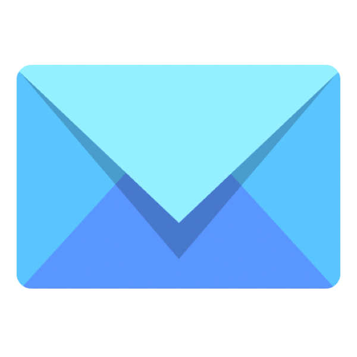{ width="300" }
  <figcaption></figcaption>
</figure>

Protocolo de acceso a mensajes de Internet o lo que es lo mismo **I**nternet **M**essage **A**ccess **P**rotocol es un servidor de correo entrante más avanzado que POP.

Con IMAP podemos leer los mensajes de correo que tengamos en la carpeta de entrada (Inbox) sin necesidad de descargarlos a nuestro ordenador o dispositivo.

Además, podemos crear carpetas en el ordenador donde tengamos configurada la cuenta pero que dichas carpetas no aparezcan en el servidor y viceversa. No obstante, podemos crear carpetas y sincronizarlas para que estén en todos los dispositivos, incluido el servidor.

Este nuevo protocolo fue creado por Mark Crispin en el año 1986 y actualmente van por la versión 4 ~ llamado IMAP4.

Sus principales características son:

=== "Conexión permanente"
    Una conexión IMAP siempre es permanente mientras el cliente de correo esté ejecutándose, es decir, está siempre escuchando por nuevos mensajes o acciones del usuario sobre el buzon de correo

=== "Conexión multiple"
    Con este nuevo protocolo varios clientes de correo pueden acceder de manera simultánea al servidor y visualizar cambios de otros dispositivos casi en tiempo real

=== "Estado del mensaje"
    El hecho de que un correo esté leido o no leido se puede verificar de manera instantánea tanto en el cliente de correo como en el servidor. No como en el protocolo POP, donde el estado de cada mensaje sólo se queda guardado en el cliente que lo cambia independientemente de si en el servidor existe un estado diferente

=== "Múltiples buzones"
    Los clientes de IMAP4 pueden crear, renombrar y/o eliminar buzones (por lo general presentado como carpetas al usuario) en el servidor, y copiar mensajes entre buzones. El soporte para múltiples buzones también le permite a los servidores proporcionar acceso a carpetas públicas y compartidas

=== "Búsqueda"
    El filtrado de búsqueda siempre se ejecuta en el servidor para obtener un mejor resultado. Se lanza la búsqueda y es el servidor quien procesa dichos criterios y se encarga de devolver al cliente el resultado


### 📮 Servidor de correo Saliente
<figure markdown>
  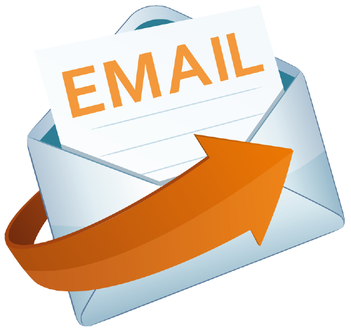{ width="300" }
  <figcaption></figcaption>
</figure>

Del mismo modo que tenemos un servidor de correo entrante donde recibimos los correos que nos llegan, también disponemos de un servidor de correo saliente donde los mensajes que queramos enviar se conectan a este servidor para ser enviados a los destinatarios.

El protocolo que controla este tipo de servidor es conocido como SMTP (**S**imple **M**ail **T**ransfer **P**rotocol) o lo que es lo mismo ***protocolo para transferencia simple de correo***.

#### 🔌 Puertos SMTP
<figure markdown>
  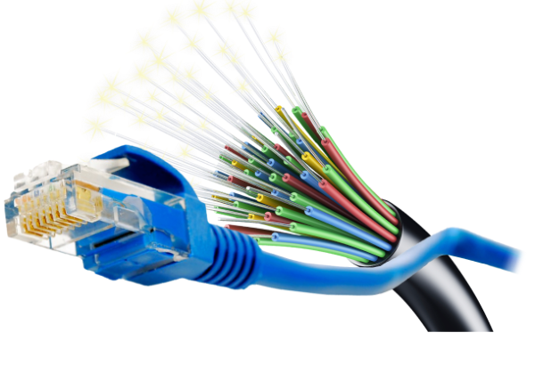{ width="300" }
  <figcaption></figcaption>
</figure>

Como ya sabemos, Internet funciona con direcciones IP y con puertos para filtrar las conexiones en función de los servicios que se necesiten.

En el protocolo SMTP se suelen utilizar los siguientes puertos:

**Puerto 25**: puerto de Protocolo simple de transferencia de email<br>
**Puerto 80**: puerto de Protocolo de transferencia de hipertexto<br>
**Puerto 465**: puerto SMTP autenticado con SSL<br>
**Puerto 587 y puerto 588**: puerto de envío de mensajes de email<br>
**Puerto 2525**: el puerto alternativo


## 👮‍♀️ Seguridad y Confidencialidad
<figure markdown>
  { width="300" }
  <figcaption></figcaption>
</figure>

A la hora de enviar información por Internet, ya sea por e-mail o alguna app de mensajería (WhatsApp o Telegram), debemos tener en cuenta que la privacidad es un tema muy importante.

### 🧮 Contactos

Cuando queremos enviar un mensaje debemos saber la dirección de la persona que lo va a recibir. Muchas veces nos parecerá algo normal el hecho de que nuestra dirección de correo sea de libre acceso o pueda adquirirla cualquiera pero, en realidad es una información privada que no debe compartirse con todo el mundo.

Existen empresas que se dedican a recopilar información personal por todo Internet para luego venderla a otras empresas que se dedican al marketing digital.

**Un contacto** puede ser un correo electrónico, un nombre de usuario en una red social, un número de teléfono o una dirección postal.

En una **ficha de contacto** podemos guardar la siguiente información:

    - Nombre
    - Apellidos
    - e-mail
    - Teléfono
    - Dirección postal
    - Fecha de nacimiento
    - URL (sitio web, Linkedin u otra red social)

Como ves, es mucha la información que podemos guardar de una misma persona e igual no tenemos el permiso de esa persona para almacenar toda esa información o igual no quiere que compartamos toda o parte su información con el resto del mundo.

### 🧑‍⚖️ Ley de Protección de datos

La ley de protección de datos (RGPD Reglamento General de Protección de Datos o LOPD Ley Orgánica de Protección de Datos de Carácter Personal) protege a todas las personas frente a un uso indebido de sus datos personales por parte de una empresa, ya sea por la venta de los mismos o por el uso en campañas de marketing.

!!! DANGER "Cuidado"
    No es ilegal que amigos, familiares o alguien que haya conseguido tu contacto te agreguen a un grupo de _Whatsapp_ o _Telegram_ sin tu consentimiento, ya que no existe una empresa o una campaña de marketing detrás de esta acción

    [➡️ Caso real ⬅️](https://www.lavanguardia.com/tecnologia/aplicaciones/20211119/7870587/anadir-alguien-grupo-whatsapp-permiso-te-salir-caro-son-consecuencias-pmv.html#:~:text=La%20respuesta%20es%20no.,chat%20colectivo%20sin%20tu%20consentimiento.){target="_blank"}


## 🖥️ Herramientas dentro de la mensajería

<figure markdown>
  { width="300" }
  <figcaption></figcaption>
</figure>

Dentro del mundo del correo electrónico tenemos muchas herramientas que nos facilitan la vida a la hora de gestionar toda la información; como es el caso de poder adjuntar archivos, calendario, lista de contactos y notas.


### 📎 Adjuntar archivos

Es una de las acciones más usadas a la hora de enviar un correo, el poder enviar archivos junto a un e-mail se hizo muy popular desde sus inicios.

Antiguamente se podía enviar todo tipo de archivos adjuntos a un correo; documentos de texto, imágenes, videos, archivos ejecutables _.exe_ y demás. Pero los problemas con los virus fueron en aumento y los servidores empezar a capar ciertos archivos.

Además, poco a poco fue evolucionando y cada vez hace falta más espacio en los servidores de correo debido a su alta demanda.

Cuanto más espacio disponible, archivos de más tamaño puedes enviar hasta que llegaron las limitaciones de los archivos adjuntos.

Dependiendo del servidor de correo que tengamos, existen ciertas limitaciones a la hora de enviar archivos:

    - Tamaño máximo de archivo adjunto ~ 25 MB
    - No es posible enviar archivos ejecutables (.exe, .bat y demás)
    - Archivos comprimidos con archivos ejecutables dentro

Para adjuntar archivos a un correo tan sólo tenemos que **pinchar en el icono del clip** 🖇️ y dependiendo del servidor de correo tendremos las siguientes opciones.

<figure markdown>
  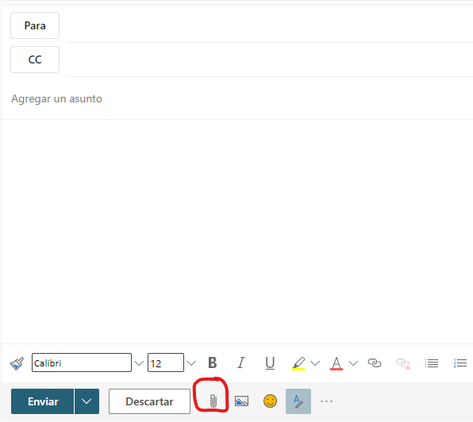{ width="300" }
  <figcaption></figcaption>
</figure>

#### ⌨️ Desde el ordenador

Al pinchar sobre esta opción se abrirá el navegador de archivos de nuestro sistema y podremos seleccionar los archivos que queramos adjuntar en el mensaje.

En una primera instancia se podrán agregar todos los archivos que queramos, pero una vez los procese el servidor de correo podrá saltarnos un mensaje de error si hemos adjuntado un archivo no permitido.


#### ☁️ Desde la nube

Al pinchar sobre la opción de la nube (o one Drive en nuestro caso) nos aparecerá una ventana de navegación y veremos todos los archivos y carpetas que tenemos en la nube.

Es una buena manera de adjuntar archivos grandes ya que aquí el tamaño es mucho mayor.

!!! WARNING "A tener en cuenta"
    La única diferencia importante es que cuando adjuntamos un archivo desde la nube, estamos enviando un acceso directo (o link) de descarga de dicho archivo, mientras que si lo adjuntamos directamente del ordenador, este archivo se almacenará en el servidor de correo.

    ¿Qué pasa si borran el archivo que me han compartido desde la nube? ~ cuando vayas a leer el e-mail otra vez y el archivo ya no esté disponible en la nube, no podrás acceder a él.


### 👥 Listado de Contactos

<figure markdown>
  { width="300" }
  <figcaption></figcaption>
</figure>

El listado de contactos es una herramienta imprescindible en todo servidor de correo electrónico. Gracias a ella podemos almacenar todos los contactos que nos interesen para poder enviar mensajes sin necesidad de ir con una libreta.

Dentro de la aplicación del **Listado de contactos** podemos hacer las siguiente acciones.

#### ➕ Agregar contacto

<figure markdown>
  { width="300" }
  <figcaption></figcaption>
</figure>

Al pinchar sobre la opción de agregar contacto podremos ver los diferentes campos a rellenar. Si pinchamos en **Agregar más** podremos agregar más campos a nuestro contacto, como el correo electrónico y demás información.

#### ➖ Eliminar contacto
<figure markdown>
  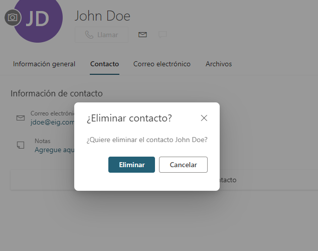{ width="300" }
  <figcaption></figcaption>
</figure>

Una vez tengamos contactos en nuestra lista, seremos capaces de eliminar contactos; podemos hacerlo de uno en uno o seleccionando varios a la vez.

#### ⏫ Exportar contactos
<figure markdown>
  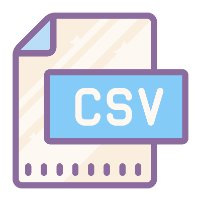{ width="300" }
  <figcaption></figcaption>
</figure>

Los contactos los hemos ido reuniendo a lo largo de los años y perder toda esa información puede ser un gran fastidio.

La mayoría de clientes de correo o gestores de contactos, ofrece la opción de poder **exportar los contactos** a un archivo para luego **importarlos** en otro cliente o plataforma.

Normalmente se exporta la información en un archivo de texto plano, con la información separada por comas (también llamado **C**omma **S**eparated **V**alues ➡️ CSV)

!!! INFO "Ejemplo de archivo CSV"

    ```CSV
    John,Doe,120 jefferson st.,Riverside, NJ, 08075
    Jack,McGinnis,220 hobo Av.,Phila, PA,09119
    "John ""Da Man""",Repici,120 Jefferson St.,Riverside, NJ,08075
    Stephen,Tyler,"7452 Terrace ""At the Plaza"" road",SomeTown,SD, 91234
    ,Blankman,,SomeTown, SD, 00298
    "Joan ""the bone"", Anne",Jet,"9th, at Terrace plc",Desert City,CO,00123
    ```
La información del archivo **CSV** se codifica cada registro en una línea y la información de cada campo se encuentra separada por comas.

👉 Ejemplo de todos los [pokemon codificado en CSV](https://bit.ly/3Tozlvq){target="_blank"} 👈

!!! TIP "Ventajas del sistema CSV"

    Una de las grandes ventajas es que es un formato de archivo estándar, lo que quiere decir que puedes importar los datos en muchos programas de gestión de datos como clientes de correo, Hojas de cálculo, editor de textos, bases de datos y más.

    Otra de las grandes ventajas que, al ser texto plano y tener una estructura muy sencilla, cualquiera puede abrir el archivo con un programa informático que maneje texto plano (como el Bloc de Notas) y editar la información sin necesidad de tener conocimientos de programación.

!!! DANGER "Recordatorio para archivos .csv"

    Recuerda que el archivo que generes debe tener la extensión **.csv** para que funcione


#### ⤵️ Importar contactos
<figure markdown>
  { width="300" }
  <figcaption></figcaption>
</figure>

La acción de importar contactos es el segundo paso; una vez que tenemos una copia de nuestros contactos podremos importar en otro sistema o libreta de direcciones.

Para importar los contactos que previamente hemos exportado, debemos ir a la sección de **contactos** e importar el archivo **.csv** que hemos generado anteriormente.

<figure markdown>
  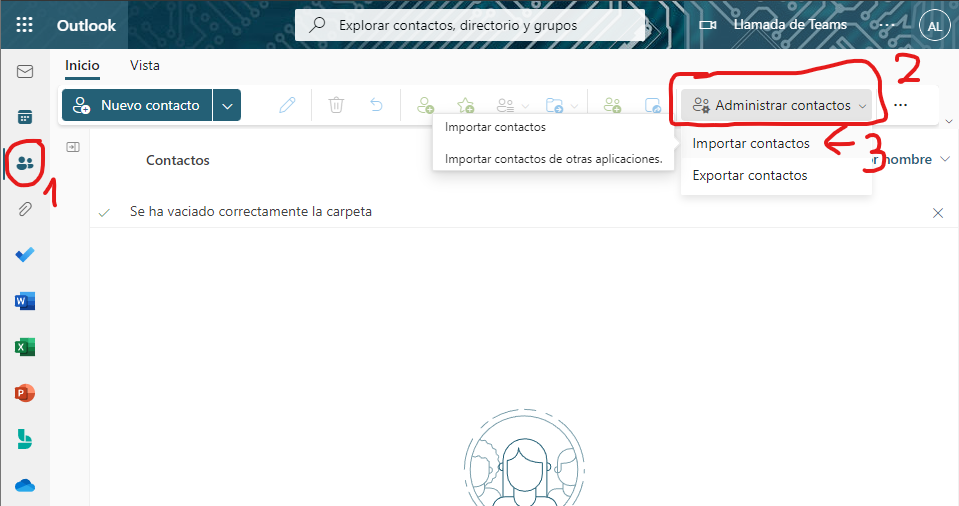{ width="500" }
  <figcaption>Buscar la opción de importar</figcaption>
</figure>

<figure markdown>
  { width="500" }
  <figcaption>Importar el archivo .csv</figcaption>
</figure>

!!! TIP "Recordad"
    
    No olvidéis que podemos importar nuestros datos en casi cualquier gestor de datos o contactos ¡¡ incluso en el Excel !!


#### ✏️ Editar contacto

Del mismo modo, en nuestra lista o en la misma vista del contacto podremos pinchar sobre la opción de editar para cambiar la información de nuestro contacto.


### 🖊️ La firma
<figure markdown>
  { width="300" }
  <figcaption></figcaption>
</figure>

Normalmente, en los correo electrónicos vemos una firma o un saludo final donde la persona que envía el mensaje se despide cordialmente y pone su nombre.

Con el paso de los años la firma de los correos ha ido evolucionando y cambiando de aspecto. Ahora podemos observar información relevante acerca del remitente (ya sea una empresa o una persona) junto con imágenes y texto formateado.

La firma es algo que se repite siempre que se envía un correo por lo que, gracias a los **clientes de correo**, podemos automatizar este fragmento del mensaje para no tener que escribirlo cada vez que envíamos un mensaje.

<figure markdown>
  { width="400" }
  <figcaption>Ejemplo de firma</figcaption>
</figure>

Como vemos en el ejemplo de arriba, la firma está formateada y aparece los siguientes elementos

#### 🤼 El saludo final

Escrito como ***Kind Regards*** que en inglés significa "Saludos cordiales" es una manera de poner siempre el saludo en al parte final del mensaje sin tener que volver a escribir.

Dependiendo de para quién vaya dirigido el mensaje escribiremos un saludo u otro

=== "Cordial"
    - Atentamente
    - Cordialmente
    - Respetuosamente
    - Quedo al pendiente
    - Quedo al pendiente de sus comentarios
    - Un cordial saludo
    - Excelente día
    - Feliz inicio de semana
    - Feliz fin de semana
    - Que sea un gran día
    - Estamos en contacto
    - Gracias
    - Muchas gracias
    - Todo mi agradecimiento
    - Muy agradecido (a)
    - Gracias de antemano
    - Gracias por todo
    - Gracias por su consideración
    - Gracias por su tiempo
    - Gracias por su ayuda
    - Con aprecio
    - Con gratitud
    - Espero su respuesta
    - Espero noticias suyas

=== "Casual"
    - Deseándote lo mejor
    - Hasta pronto
    - Hasta luego
    - Cuídate
    - Afectuosamente
    - Que tengas un excelente día
    - Que disfrutes tu día
    - Buena suerte
    - Feliz [festividad, aniversario, cumpleaños, etc.]
    - Que tengas un gran día
    - Espero ayudarte
    - Contento (a) / Feliz de saludarte
    - Espero verte pronto
    - Tu amigo (a)
    - Te deseo lo mejor
    - Un abrazo
    - Disfruta tu **[día de la semana]**
    - Un placer saber de ti

#### 🐡 Logotipo o imagen de perfil
<figure markdown>
  { width="150" }
  <figcaption></figcaption>
</figure>

En el caso de estar trabajando en una empresa, normalmente se pone el logotipo de la misma o, en caso de hacerlo más personal se puede sustituir por una foto de perfil de la persona que está enviando el mensaje.

Es muy útil a la hora de recordar o visualizar un mensaje ya que los elementos gráficos entre tanto texto nos ayuda a organizar y procesar mejor la información.

#### 📨 Remitente

En el caso del ejemplo ***Robert Johnson / Cofundador AV Media*** donde ponemos nuestro nombre completo y lo que somos, independientemente de si estás trabajando en una empresa o eres estudiante.

#### ℹ️ Información de contacto adicional

Cuando envíamos un correo, nuestra dirección aparece como remitente del mensaje. En las firmas de correo se suele poner información adicional de contacto como es el caso del ejemplo.

    - Teléfono
    - El correo electrónico
    - La URL de la empresa o personal
    - Las redes sociales

#### 📙 Creando la firma
<figure markdown>
  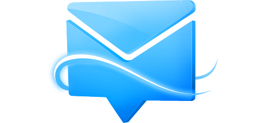{ width="300" }
  <figcaption></figcaption>
</figure>

La firma se puede crear a través del cliente de correo, ya sea web o un software que nos descarguemos como **Thunderbird**, **eMClient** entre otros.

Para la creación de la firma vamos a utilzar el cliente web **Outlook** desde la web oficial de [Office](https://www.office.com){target="_blank"}

<figure markdown>
  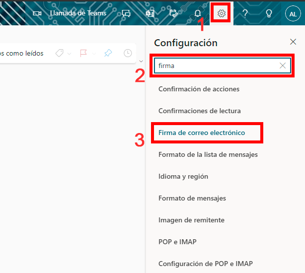{ width="300" }
  <figcaption></figcaption>
</figure>

    1. Pinchar sobre el icono de configuración y opciones ⚙️ situado en la parte superior derecha
    2. En la barra de búsqueda escribir **firma** para filtrar las opciones
    3. Pinchar en **Firma de correo electrónico**

<figure markdown>
  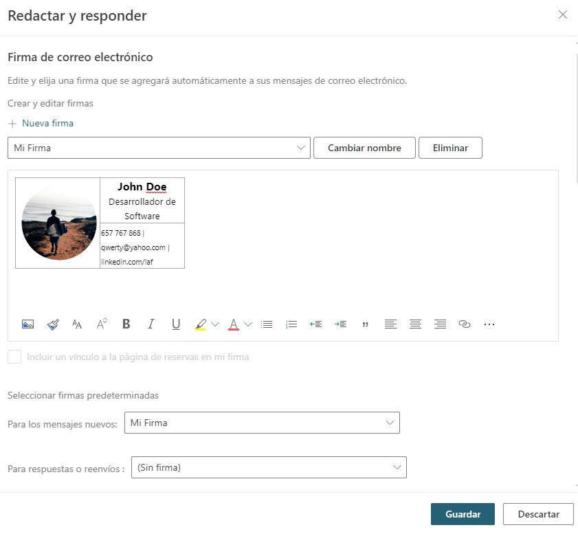{ width="300" }
  <figcaption></figcaption>
</figure>

Una vez seguidos los pasos anteriores la página nos mostrará un cuadro de diálogo donde tendremos que rellenar los siguientes campos

##### Editar nombre de firma
    Nombre descriptivo de la firma en cuestión

##### Area de texto enriquecido
    Aquí editamos la firma entera, dándole el formato que queramos

##### Seleccionar firmas predeterminadas
    Este campo se habilitará una vez tengamos alguna firma ya creada

!!! INFO
    Una vez creada la o las firmas, podremos seleccionar una como predeterminada a la hora de escribir correos nuevos


### 📆 Calendario
<figure markdown>
  { width="300" }
  <figcaption></figcaption>
</figure>

El calendario es una herramienta muy útil para no olvidar las fechas importantes en nuestro día a día.

Gracias a las herramientas que nos proporciona [Office](https://outlook.office.com/calendar/view/month){targer="_blank"} podemos gestionar el calendario a nuestro gusto con un sinfín de opciones.

!!! INFO "Accediendo al calendario"
    Para entrar en nuestro calendario debemos ir a [Office](https://outlook.office.com/calendar/view/month){targer="_blank"} o pinchando sobre el icono del calendario que está dentro del apartado **Outlook**

Lo primero que veremos será la vista del calendario por meses y las opciones de las que disponemos.

#### 🎟️ Eventos

Los eventos son fechas señaladas donde nosotros podemos establecer un día y una hora para generar una alarma y que el sistema nos avise cuando llegue ese momento.

Para configurar un nuevo evento **pincharemos sobre el día** que queramos y estableceremos los parámetros en función de nuestras necesidades. Imaginemos que el día 7 de noviembre tenemos el examen del Tema 2:

<figure markdown>
  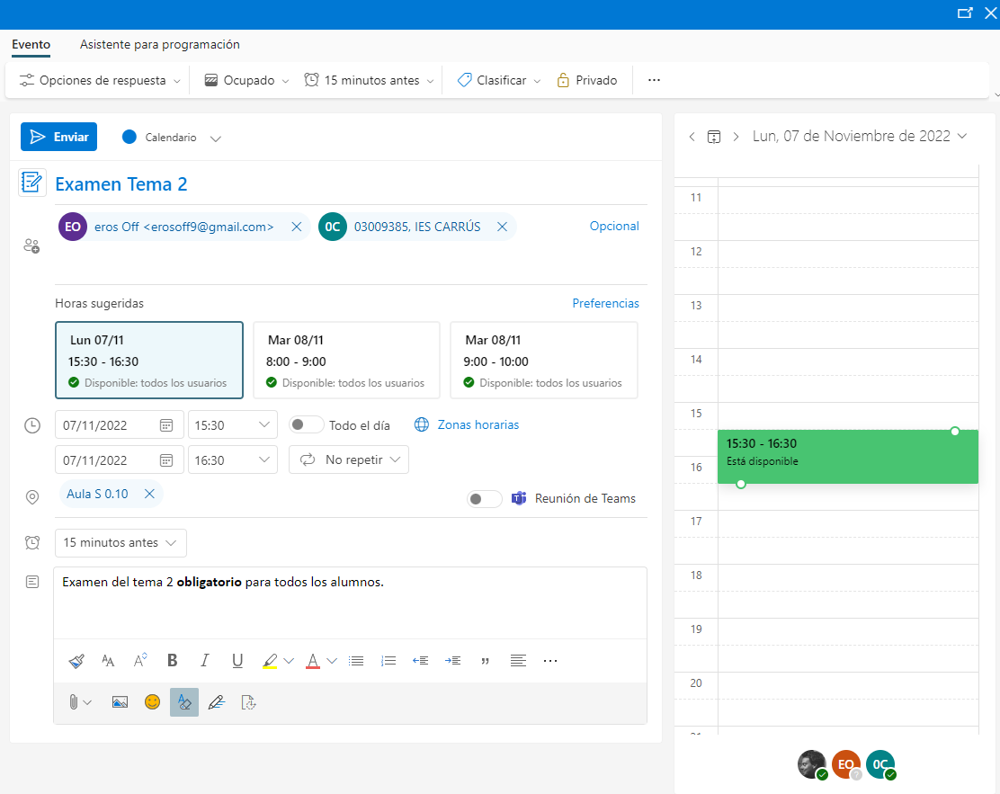{ width="600" }
  <figcaption></figcaption>
</figure>

Al pinchar en el día dentro del calendario se abrirá una pantalla con las opciones disponibles. Podemos pinchar en la opción **Más opciones** para añadir más información al evento seleccionado.

- **Agregar un título**: Título descriptivo del evento
- **Invitar a asistentes**: En el caso de que queramos notificar a varias personas de dicho evento
- **Rango de fecha**: La fecha del evento ➡️ puedes ser un día o un rango de fecha como una semana o varias
- **Buscar una sala o ubicación**: Información acerca de dónde se celebrará dicho evento
- **Recordatorio**: Cuándo recordarte esta fecha (mediante correo electrónico o notificación de la App)
- **Agregar una descripción**: Detalles más en profundidad del evento en cuestión
- **Clasificar**: Establecer un color de la categoría del evento o crear nuevas categorías
- **Privado**: Los calendarios pueden ser privados (sólo los ves tú) o públicos


#### 🪟 Vistas

Al tener tanta información, Office nos brinda la posibilidad de intercambiar las vistas de cómo se muestran los eventos y calendarios en la pantalla

Podemos mostrar la información de las siguientes maneras:

- **Día**: Muestra todos los eventos de un mismo día
- **Semana laboral**: Muestra todos los eventos de una semana, con su franja horaria
- **Semana**: Lo mismo que *Semana Laboral* pero incluyendo el sábado y domingo
- **Mes**: Muestra todos los eventos del mes de una manera resumida (sin franjas horarias)

En el panel de la izquierda (*sidebar*) podemos filtrar los resultados de la vista en función de los calendarios que queramos ver

<figure markdown>
  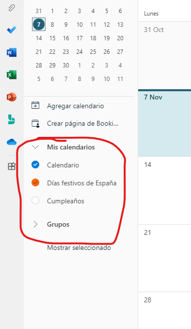{ width="300" }
  <figcaption>Filtrando resultados</figcaption>
</figure>

De esta manera, el sistema nos mostrará la información, con distintos colores, de los eventos de los eventos seleccionados a mano izquierda de la pantalla.


#### 🛞 Configuración

El calendario es completamente configurable a través del menú de configuración. Para acceder a dicho menú debemos pinchar sobre el icono del engranaje ⚙️ situado arriba a la derecha de la pantalla ↗️

<figure markdown>
  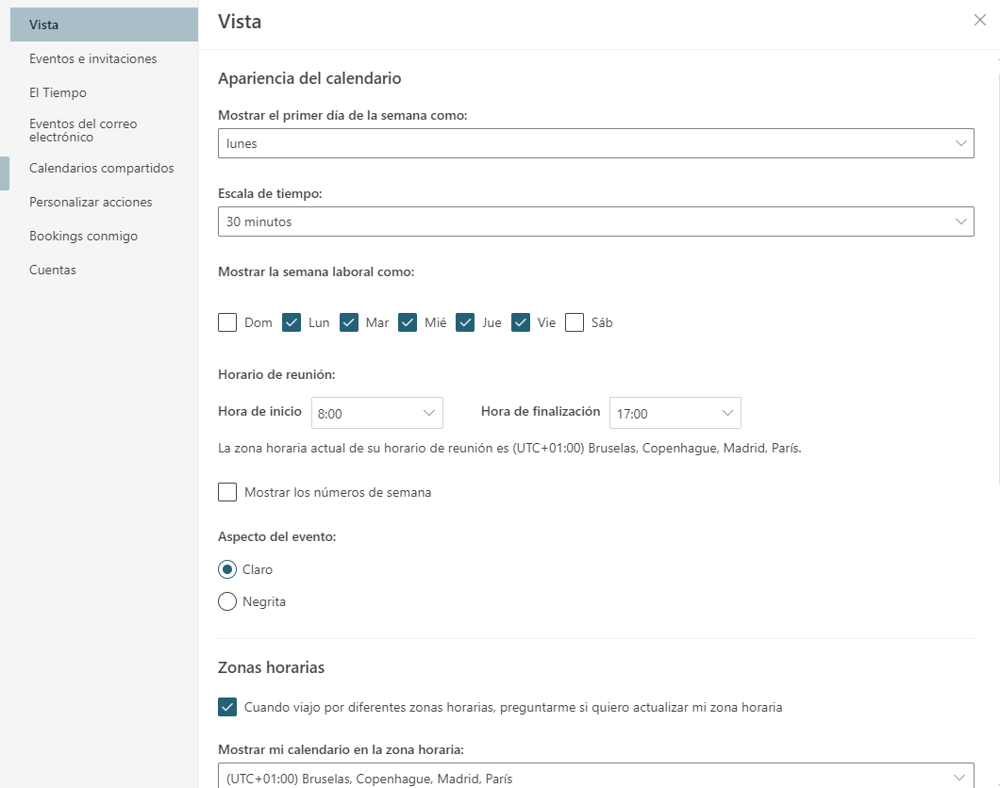{ width="300" }
  <figcaption></figcaption>
</figure>


---

## 🧰 EJERCICIOS

1.- ❎ Investiga sobre los distintos programas de comunicación que existen (Discord, Slack y Microsoft Teams) explicando:

    - Un poco de su historia
    - Suscripciones para empresas, características y precios
    - Añades imágenes de cómo es su interfaz
    - ¿Has utilizado alguna de estas herramientas? ¿qué es lo que más te gusto de ellas?

---

2.- ❎ En Windows 11 (y versiones anteriores) es posible enviar mensajes a través de la red. Investiga cómo utilizar el comando "msg" o "net send" en sistemas Windows anteriores.

---

3.- ❎ ¿Es posible enviar mensajes a través de la red si estoy usando Linux? Investiga qué comando necesitas usar para enviar mensajes y haz un par de pruebas con los compañeros de clase. Adjunta capturas de pantalla de los mensajes que envíes; una captura tuya utilizando el comando en la consola y otra captura de tu compañero recibiendo dicho mensaje. Que tu compañero te envíe por OneDrive o correo electrónico dicha captura.

---

4.- ❎ Explica las diferencias entre una IP interna y una externa. Investiga en Internet sobre el tema para obtener más información PERO explícalo con tus palabras. Puedes añadir imágenes si lo ves oportuno ¿cómo hago (qué comando) para saber mi IP privada y mi IP pública?

---

5.- Haz una lista de hasta 3 mensajes internos y otra de 3 mensajes externos con los pasos, dispositivos y ***software*** que necesitas para enviar mensajes de un dispositivo a otro.

!!! WARNING "Ejemplo"
    - Interno ➡️ de PC a PC a través de la consola con el comando "msg" la IP (o nombre de red) del destino y el mensaje que quiero enviar

---

6.- ❎ ¿Cómo es posible que el correo electrónico sea anterior a Internet? Investiga sobre el asunto y explica los primero usos de este tipo de mensajería.

---

7.- ❎ ¿Qué es el ***Phishing***? explica cómo los *hackers* utilizan esta técnica ¿lo harías? ¿crees que vale la pena hacerlo? reflexiona sobre los pros y contras de utilizar estra técnica para conseguir dinero rápido.

---

8.- ❎ Haz una investigación acerca de los diferentes clientes de correo electrónico de la lista que hemos visto, poniendo la siguiente información:

    Logotipo
    Nombre
    Historia
    Características
    Planes de suscripción o licencia (gratuita o no)
    Plataformas (Windows, Mac, Android, iOS)

---

9.- ❎ Haz una lista con al menos 10 puertos de Internet más utilizados con su número de puerto y descripción de lo que hace. Por ejemplo

FTP [21]: El protocolo FTP, acrónimo de «File Transfer Protocol», es un protocolo de transferencia de archivos a través de la red entre sistemas conectados a través de conexiones TCP

Además, di si existe algún cliente para ese protocolo, pon el logotipo del software, el nombre y el tipo de licencia (gratis o de pago y los distintos planes)

---

10.- ❎ Enumera y explica las diferencias entre los 2 protocolos de correo entrante IMAP4 y POP3

---

11.- ❎ Enumera y explica cada uno de los puertos que se utilizan en las conexiones del servidor de correo saliente SMTP

---

12.- ❎ Investiga las limitaciones de archivos adjuntos en tu servidor de correo. ¿Cómo podría enviar por e-mail un archivo de 1GB de tamaño? encuentra hasta 5 proveedores de este tipo de servicio de almacenamiento y explica sus características

---

13.- Añade a todos los compañeros de clase a tu lista de contactos. Una vez tengas hecho ésto, envía un e-mail a todos ellos con el siguiente mensaje "Hola! soy John Doe y esto es una prueba para el ejercicio 13" donde **John Doe** tienes que sustituirlo por tu nombre y apellidos. Haz una captura de pantalla del mensaje enviado que estará ubicado en la **bandeja de salida** y súbelo a Aules.

---

14.- ❎ Busca información sobre qué es la Lista Robinson y haz un documento contando por qué fue creada y para qué sirve.

---

15.- Crea al menos 3 firmas de correo electrónico a través del cliente web **Outlook** que nos brinda [Office](https://www.office.com){target="_blank"} y haz una captura de pantalla de cada una de las firmas para **adjuntarlas en Aules**. Lleva cuidado con qué información pones en cada una de las firmas, ya sabes que dependiendo del destinatario debes colocar una info u otra. Las 3 firmas deben ser de diferente categoría:

    - Cordial (para empresas)
    - Informal (para amigos)
    - Familiar (para la familia o amigos muy cercanos)

!!! DANGER "Normas para crear las firmas"
    - Guarda cada firma con el nombre de la categoría ➡️ Firma Cordial
    - Deben contener una imagen tuya como perfil de la firma
    - Debe tener tu nombre y apellidos, así como la información de contacto adicional
    - Formatea el texto de tal manera que se diferencie el nombre como lo más importante

---

16.- Haz lo mismo que en el ejercicio 15 pero esta vez que sea una firma de una imagen corporativa. Recuerda poner el logo de la empresa y la información que toque al respecto. Sube una captura de pantalla a Aules con el resultado. Guarda la firma con el nombre **Firma Corporativa**.

---

17.- Crea, dentro de tu Office, un calendario por cada una de las asginaturas que curses este año y estableces las fechas de los eventos que estén por llegar:

    Exámenes
    Trabajos
    Libretas
    Eventos (cumpleaños de los compañeros, por ejemplo)

---

18.-  Crea un calendario que sea el calendario escolar del curso **1º FP Básica de Ofimática** con este mismo título y establece todos los días que sean festivos para el curso lectivo 2022-2023 así como los días de evaluación y diferentes eventos que puedan existir.

---

19.- Crea un evento en el calendario general que sea el día de tu cumpleaños. Como invitados, mete a todos tus compañeros y al profesor para que les llegue la notificación. Con respecto a la franja horaria puedes establecer **todo el día**.

---

20.- Exporta todos los contactos que tengas en **Outlook** dentro de tu cuenta de Office, a un archivo **.csv**. Una vez que tengas los contactos a salvo, elimina todos los contactos desde la página de **Outlook**. Abre el archivo **.csv** y agrega el siguiente contacto:

    - Nombre: Bruce
    - Apellidos: Lee
    - e-mail: brucelee@gmail.com

Una vez eliminados, importa los contactos de nuevo a tu libreta de direcciones desde el archivo **.csv** que has exportado. Haz capturas de cada proceso y sube todo a Aules:

!!! DANGER "Contenido del archivo .zip a subir"

    - lista-contactos.jpg (captura de tus contactos)
    - contactos.csv (los contactos exportados ➕ contacto nuevo)
    - lista-vacia.jpg (captura de los contactos vacíos)
    - lista-importada.jpg (captura de los contactos importados con el nuevo contacto agregado a mano)

---

21.- Crea un archivo en Excel con los datos de los pokemon que hemos visto en los apuntes. Recuerda estilizar un poco la tabla con colores, alineado, bordes... a libre elección. Sube el archivo de excel a Aules.