---
hide:
  - footer
---


# Procesadores de texto

En este nuevo tema aprenderemos a manejar el procesador de textos. Seremos capaces de elaborar distintos documentos utilizando las herramientas que nos brindan los diferentes procesadores de textos más usados.

Pero ¿qué es un procesador de textos?

!!! INFO "Definición"
    Un procesador de textos es un software para ordenador que permite crear documentos con un aspecto profesional; suelen disponer de revisión ortográfica, inclusión de tablas, imágenes, gráficos y más herramientas para poder representar la información de una manera más gráfica y cómoda para la vista.

En este curso vamos a empezar utilizando un procesador de textos un poco más básico llamado **Typora** y después nos meteremos de lleno a utilizar la _suite Office 365_ de Microsoft que nos proporciona la GVA a través de la identidad digital.

## Typora

<figure markdown>
  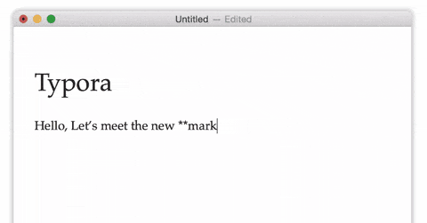{ width="500" }
  <figcaption></figcaption>
</figure>

Typora es un editor de texto minimalista compatible con Windows, Mac y, por supuesto, Linux. Es completamente gratuito y tiene soporte para _Markdown_. [Lo puedes descargar desde su página oficial](https://typora.io/){target="_blank"}

!!! WARNING "¿Qué es Markdown?"
    Markdown es un lenguaje de marcado ligero creado por John Gruber y Aaron Swartz que trata de conseguir la máxima legibilidad y facilidad de publicación tanto en su forma de entrada como de salida, inspirándose en muchas convenciones existentes para marcar mensajes de correo electrónico usando texto plano... [Para más información](https://es.wikipedia.org/wiki/Markdown){target="_blank"}

### Sintaxis de Markdown

Para poder utilizar _Markdown_ dentro del procesador de textos **Typora** es necesario conocer la sintaxis especial de _Markdown_. La sintaxis se suele poner delante del texto (ya sea una palabra o un párrafo). Hay que tener mucho cuidado con los espacios en blanco entre los símbolos de la sintaxis y el texto original que se quiere mostrar

Veamos más en detalle la sintaxis más utilizada:

|Sintaxis|Descripción|Ejemplo|
|---------------|------------|------------|
|#|Título 1| # Esto es un título 1 (el más grande) |
|##|Título 2| ## Esto es un título 2     |
|###|Título 3| ### Esto es un título 3    |
|####|Título 4| #### Esto es un título 4   |
|#####|Título 5| ##### Esto es un título 5  |
|######|Título 6| ###### Esto es un título 6 |
| * | Texto en cursiva | \*este texto está en cursvia\* |
| _ | Texto en cursiva | \_este texto está en cursvia\_ |
| ** | Texto en negrita | \*\*este texto está en negrita\*\* |
|\[Texto del enlace\]\(url\)|Enlaces a otras páginas | \[Enlace a Google\]\(https://www.google.es\)|
|\!\[Texto alternativo\]\(url del archivo\)|poner imágenes | \!\[mi avatar\]\(avatar.png)|

Para ver más sintaxis y poder crear más elementos con _Markdown_, como por ejemplo; tablas, listas ordenadas y desordenadas y combinar la sintaxis puedes [visitar este enlace](https://markdown.es/multimarkdown/){target="_blank"}.

!!! ERROR "... y recuerda"
    Esta página de apuntes está creada totalmente con _Markdown_


## Microsoft Office

<figure markdown>
  { width="500" }
  <figcaption></figcaption>
</figure>


Las suites ofimáticas actuales suelen integrar al menos los siguientes programas:

- Procesador de textos: Permite crear documentos con un aspecto profesional; suelen disponer de revisión ortográfica, inclusión de tablas, imágenes, etc.

- Hoja de cálculo: Sirve para organizar datos y números en tablas y operar con ellos, también disponen de creación de gráficos, inserción de imágenes, etc.

- Programa de presentaciones: Se utiliza para realizar un pase de diapositivas de imágenes y/o texto, con efectos de transición, música, etc.

- Base de datos: Permite organizar y consultar gran cantidad de datos (Nombres, direcciones, inventarios, etc).

Hoy en día, la suite ofimática más conocida es la de Microsoft Office, que engloba el procesador de textos Word, la hoja de cálculo Excel, el programa de presentaciones Powerpoint y la base de datos Access, además de otros programas para la gestión del correo electrónico, gestión de imágenes, etc.

El siguiente [enlace](https://www.office.com){target="_blank"} te llevará a la página oficial de Microsoft Office.


## Google Docs

<figure markdown>
  { width="500" }
  <figcaption></figcaption>
</figure>

De la misma manera que Office, Google Docs tiene las mismas herramientas de ofimática para poder trabajar con todo tipo de documentos creados por odenador.

Normalmente usaremos las aplicaciones de Google Docs a través del servicio totalmente gratuito en la nuve de Google. Las aplicaciones se pueden utilizar en el propio navegador.

Se pueden crear y editar documentos compatibles con Office y viceversa; podemos abrir documentos creados desde Office, editarlos y volverlos a guardar en el mismo formato.

!!! INFO
    Para acceder a los _Suite_ de Google Docs necesitaremos una cuenta de Google (o gmail) y accederemos a través del siguiente enlace [drive.google.com](https://drive.google.com){target="_blank"}

### Creando un documento
<figure markdown>
  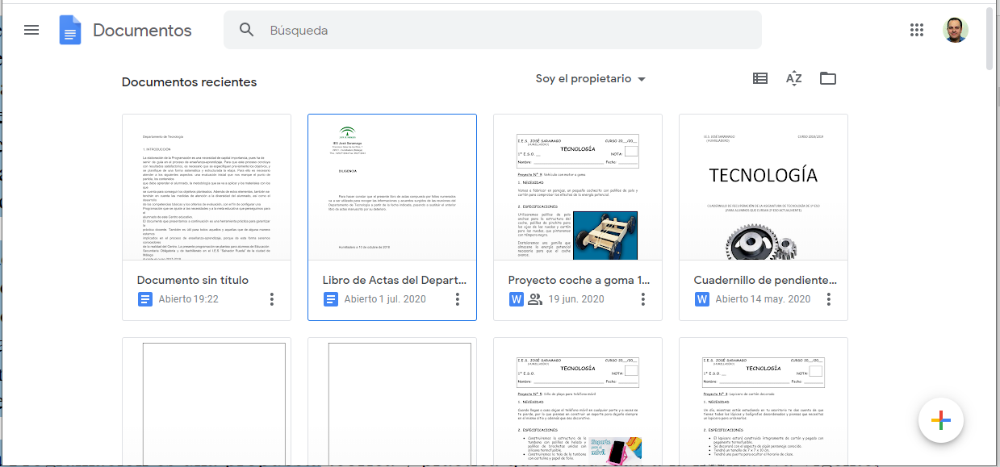{ width="800" }
  <figcaption></figcaption>
</figure>


Para crear un documentoNos aparecen los documentos que hemos editado ordenados por fecha de modificación. Podemos elegir cualquiera de ellos, buscarlo en la barra de búsqueda o crear uno nuevo pulsando el botón "+" de la esquina inferior derecha.

Si creamos un nuevo documento, nos saldrá la siguiente pantalla que corresponde al procesador de textos. (También podemos llegar a esta pantalla desde nuestro Google Drive, Pulsando el botón "+" y eligiendo "Nuevo -> Documentos de Google -> Documento en blanco").

<figure markdown>
  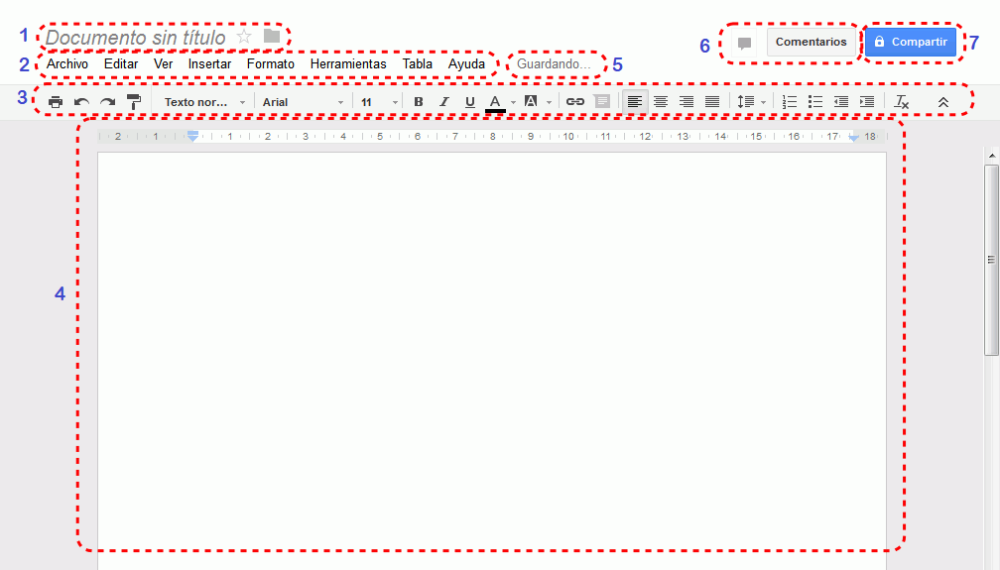{ width="800" }
  <figcaption></figcaption>
</figure>

1. El título del documento se puede modificar haciendo clic sobre él. También se puede destacar el documento y moverlo a una carpeta haciendo clic en el icono de carpeta. 

2. Los menús son similares a los de cualquier procesador de textos. 

3. La barra de herramientas es similar a la de cualquier procesador de textos y contiene las funciones más comunes, que también se encuentran en los menús. 

4. El espacio de edición del documento contiene una regla y el espacio donde se escribe, propiamente dicho. 

5. Los documentos en Google Drive se guardan automáticamente. 

6. Se pueden añadir comentarios a un documento. 

7. Los documentos se pueden compartir con otras personas haciendo clic en el botón "Compartir".


### Abriendo y guardando documentos

Si queremos abrir un documento ya existente, dentro de Google Docs elegimos Archivo -> Abrir, entonces se abrirá un cuadro de diálogo en el que tenemos varias opciones, como podemos ver en la siguiente captura de pantalla:

|Documento desde la nube|Subir un documento|
|-|-|
|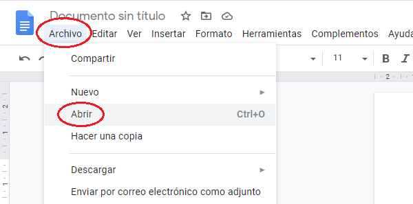|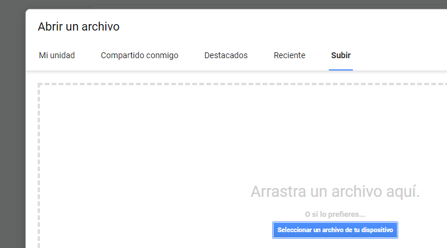|


Las distintas opciones que tenemos en este cuadro de diálogo son:

- **Mi unidad**: Se abren los documentos que tenemos guardados en Google Drive.

- **Compartido conmigo**: Se abren los documentos compartidos que están guardados en el Google Drive de los propietarios de dichos archivos. (Podemos hacer una copia y guardarla en nuestros dispositivos con la opción Archivo -> Hacer copia).

- **Destacados**: Se abren los documentos que hemos guardado como destacados con la estrella de cinco puntas.

- **Reciente**: Se abren los últimos documentos en los que hemos estado trabajando.

- **Subir**: Nos permite abrir un documento guardado en nuestro ordenador o dispositivo y modificarlo. (El archivo abierto se guarda en Google Drive, si queremos guardarlo en nuestro ordenador o dispositivo, elegiremos Archivo -> Descargar).


### Exportando un documento

<figure markdown>
  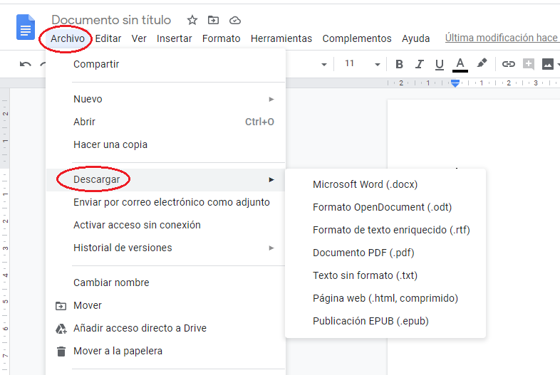{ width="800" }
  <figcaption></figcaption>
</figure>

Como vemos, la opción Archivo -> Descargar nos permite guardar el documento en varios formatos, entre ellos, el formato de Microsoft Word (.docx) o el formato de LibreOffice (.odt) aunque el aspecto de nuestro documento puede sufrir modificaciones, si vamos a enviar el archivo (por ejemplo un trabajo a un profesor) es preferible descargarlo como Documento PDF (.pdf), que conserva la forma de nuestro trabajo siempre.

La única desventaja que tienen los documentos PDF es que no se pueden modificar.

!!! WARNING "Sabías qué..."
    Una forma rápida de enviar un documento de Google Docs es mediante la opción Archivo -> Enviar por correo electrónico adjunto, que nos permite enviar el documento actual mediante correo electrónico en un solo paso.

    Otra opción interesante es Archivo -> Historial de versiones -> Ver el historial de versiones, que nos permite ver y volver a cualquier momento en la edición del documento, una opción muy útil si hemos borrado algo por error durante la edición.

    Aunque Google Docs es un editor de textos online, si lo instalamos en nuestro dispositivo, podemos editar un documento sin necesidad de estar conectados a Intenet, marcando la opción Archvo -> Activar acceso sin conexión.


### Manejando el texto

Cuando creamos documento nuevo Google Docs, tendremos una página en blanco donde podremos escribir dentro de un recuadro que nos delimita los márgenes (Ya veremos cómo configurarlos).

Una de las operaciones que más se realiza en un procesador de textos es la de seleccionar texto, para esto existen los siguientes métodos:

Con el botón izquierdo del ratón presionado y arrastrándolo por el texto veremos como se marca el área que nosotros recorremos con azul, esto nos indica la zona del texto seleccionada. De esta manera podremos marcar fácilmente la porción de texto con la que deseamos trabajar.

**Otras maneras de realizar esta tarea es la de hacer clic sobre el texto, lo cual hará lo siguiente:**

- Con dos clics marcamos una palabra entera.

- Con tres clics un párrafo entero.

- Con la combinación de teclas Control + A seleccionamos todo el texto.


**Para copiar texto podemos hacerlo de la siguiente forma:**

- Eligiendo del menú la opción Editar -> Copiar.

- Con la combinación de teclas Control + C.

<figure markdown>
  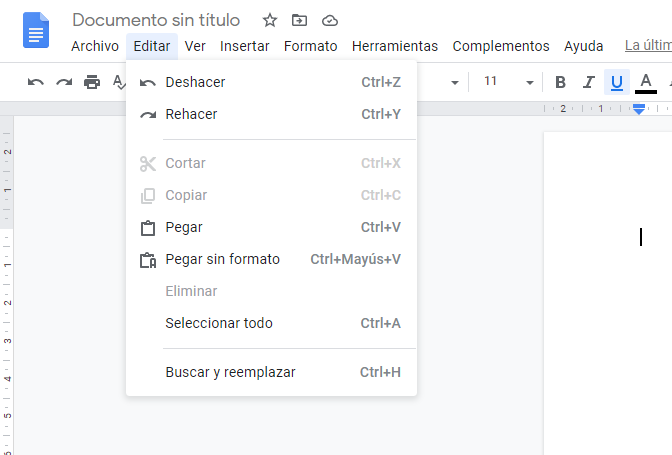{ width="500" }
  <figcaption></figcaption>
</figure>


**Para cortar texto podemos hacerlo de la siguiente forma:**

- Eligiendo del menú la opción Editar -> Cortar.

- Con la combinación de teclas Control + X.


**Para pegar texto copiado podemos hacerlo de la siguiente forma:**

- Eligiendo del menú la opción Editar -> Pegar.

- Con la combinación de teclas Control + V.

!!! WARNING "Sabías qué..."
    Se puede copiar texto de otro documento o de una página de Internet. Una opción muy interesante es Editar -> Copiar sin formato, muy útil cuando copiamos texto de páginas de Internet (Como Wikipedia), ya que nos elimina los hipervínculos, las negritas, inclinadas, etc.

    A veces necesitamos escribir un carácter que no está en el teclado, entonces podemos insertarlo mediante la opción Insertar -> Caracteres especiales.


**Si nos equivocamos y queremos deshacer los cambios hechos (por ejemplo si borramos texto), tenemos varias opciones:**

- Con el icono Deshacer de la barra de herramientas. (<-)

- Eligiendo del menú la opción Edición -> Deshacer.

- Con la combinación de teclas Control + Z.

**Se pueden deshacer tantos pasos comp querramos y si nos pasamos deshaciendo, existe la opción rehacer, con la que también tenemos varias opciones:**

- Con el icono Rehacer de la barra de herramientas. (->)

- Eligiendo del menú la opción Edición -> Rehacer.

- Con la combinación de teclas Control + Y.


### Formateando un documento

Formatear un documento es darle la forma que queremos para hacerlo más atractivo, cambiando la forma de la página, el tipo, tamaño y color de la letra o la alineación de los párrafos.

En el menú Formato encontramos opciones para realizar estos cambios, aunque cada opción tiene su correspondiente botón en a barra de herramientas.


<figure markdown>
  { width="800" }
  <figcaption></figcaption>
</figure>

#### Formato de página

También podemos dar formato al área de trabajo, cambiando el tamaño de la hoja, la orientación y la separación de los márgenes. Para ello, activaremos la siguiente ventana en Archivo -> Configuración de la página.

<figure markdown>
  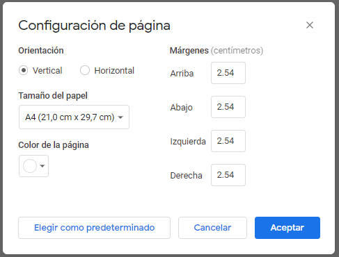{ width="600" }
  <figcaption></figcaption>
</figure>

Nos aparece este cuadro de configuración, donde podemos cambiar la orientación, el tamaño y el color de la hoja y las medidas de los márgenes de la hoja. También podemos establecer nuestra configuración de página predeterminada.

!!! INFO "Ejemplo"
    En el siguiente trabajo sobre Don Quijote de la Mancha hemos utilizado la siguiente configuración de página. Observa los cambios que se han hecho respecto a la configuración predeterminada.

|Resultado|configuración|
|-|-|
|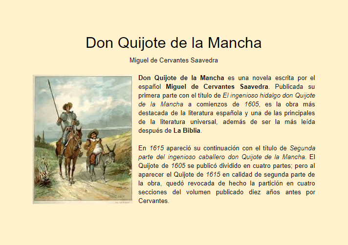|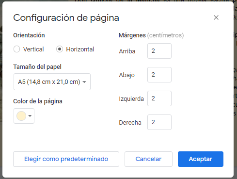|


#### Formato de texto

<figure markdown>
  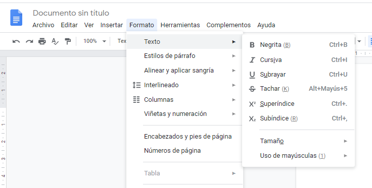{ width="800" }
  <figcaption></figcaption>
</figure>


En el <span color="yellow">ejemplo</span> anterior hay palabras que tienen distintos tamaños, otras están en negrita y otras inclinadas.

Mediante la barra de herramientas podemos cambiar fácilmente el tipo fuente de la letra, el tamaño o el tipo de letras (Negrita, inclinada o subrayada), así como el color de las letras.

Se pueden acceder a más fuentes además de las predeterminadas desde el menú de fuentes.

También podemos acceder a varias de estas opciones desde la opción del menú Formato -> Texto y a algunas más como superíndice y subíndice. En este menú se muestran las combinaciones de teclas que nos permiten cambiar las opciones del texto.


#### Formato de párrafo

<figure markdown>
  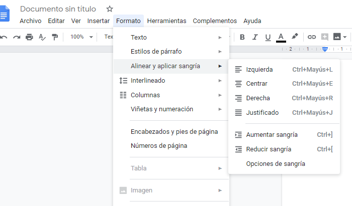{ width="800" }
  <figcaption></figcaption>
</figure>

En la barra de herramientas hay cuatro iconos que nos permite cambiar la alineación de los párrafos a la izquierda, centrado, a la derecha o justificado.

En los trabajos que se vayan a imprimir se suele utilizar la alineación justificada por resultar más equilibrado, pero en documentos que sólo se van a leer en pantallas (PC, tablet o móvil) se suele utilizar una alineación a la izquierda para una mejor lectura.

También podemos acceder a varias de estas opciones desde la opción del menú Formato -> Alinear y aplicar sangría y a algunas más como Opciones de sangría.

##### La sangría

<figure markdown>
  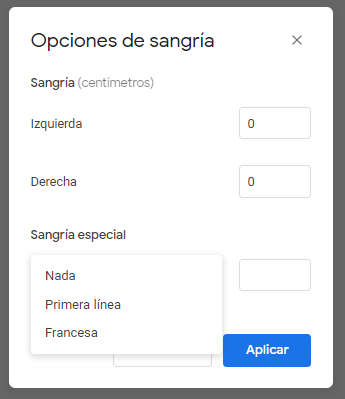{ width="500" }
  <figcaption></figcaption>
</figure>

En algunos textos, se pone la primera palabra de un párrafo o el párrafo entero más a la derecha que el resto del párrafo; esto es lo que se conoce como sangría.

Podemos aumentar o disminuir la sangría de un párrafo entero mediante los botones correspondientes de la barra de tareas o mediante la opción **Formato -> Alinear y aplicar sangría -> Aumentar o reducir sangría**
Con la opción Formato -> Alinear y aplicar sangría -> Opciones de sangría, llegamos a la siguiente ventana de configuración donde podemos configurar una sangría a todo el párrafo a la izquierda o derecha del mismo o podemos aplicar una sangría especial al párrafo o párrafos seleccionados:

- **Sangría en la Primera línea**: Se aplica solo a la primera línea del párrafo.
- **Sangría Francesa**: Se aplica a todo el párrafo excepto a la primera línea.


#### Listas de texto

En ocasiones necesitamos hacer una lista o enumeración de palabras o frases, para ello disponemos de numeración y viñetas:

- Eligiendo los botones de la barra de formato (Listas numeradas o listas con viñetas).
- Eligiendo la opción **Formato -> Viñetas y numeración**


### Insertando imágenes

Para enriquecer nuestros documentos podemos insertar imágenes en cualquier parte del mismo, para ello tenemos varias posibilidades:

- Insertar una imagen guardada en el ordenador.
- Insertar una imagen de Internet.
- Insertar una imagen guardada en Google Drive o en Google fotos.
- Insertar una imagen mediante su URL (Dirección de Internet).
- Insertar una imagen tomada directamente con la cámara del dispositivo

Para insertar una imagen desde un archivo debe situarse el cursor en la parte del documento donde desea insertarla, y a continuación elegir **Insertar -> Imagen >**, entonces se abre el siguiente menú de selección. También podemos llegar al mismo menú de selección pulsando el icono de Insertar imagen, que está señalado en la siguiente imagen.

<figure markdown>
  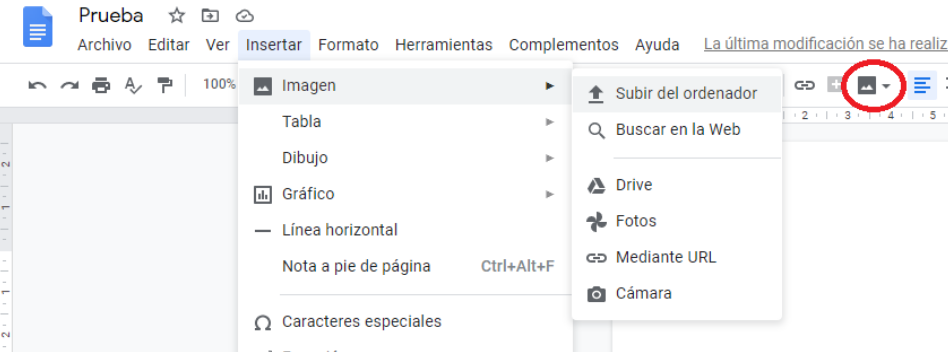{ width="500" }
  <figcaption></figcaption>
</figure>

En el caso de elegir **Insertar -> Imagen -> Buscar en la Web**, se nos abre una pequeña ventana vertical a la derecha de Google Docs con las imágenes buscadas en Google, para que podamos insertarlas directamente pulsando el botón insertar o arrastrándolas hasta nuestro documento, como podemos ver en la siguiente imagen:

(Se pueden insertar varias imágenes a la vez seleccionándolas de la ventana de búsqueda).

<figure markdown>
  { width="500" }
  <figcaption></figcaption>
</figure>


##### Propiedades de una imagen

Cuando pulsamos sobre una imagen insertada en el documento, la barra de herramientas cambia, y aparecen nuevos iconos para cambiar la imagen:

<figure markdown>
  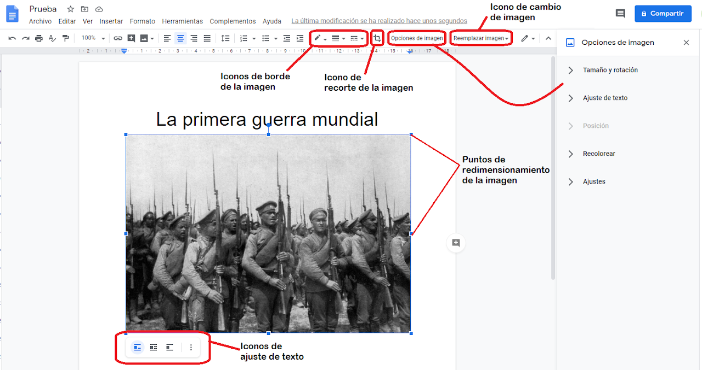{ width="500" }
  <figcaption></figcaption>
</figure>

- **Puntos de redimensionamiento de la imagen**: Sirven para cambiar el tamaño de la imagen, con el punto redondo podemos girarla.
- **Iconos de bode de la imagen**: Nos permite insertar un borde a la imagen  y cambiar su color, su grosor y su forma.
- **Icono de recorte de la imagen**: Con el podemos recortar la imagen desde cualquier borde.
- **Opciones de imagen**: Al pulsar sobre el mismo, nos aparece un menú de opciones de imagen a la derecha de nuestro documento.
- **Reemplazar imagen**: Sirve para cambiar la imagen seleccionada por otra. Al pulsarlo nos vuelve a aparecer el menú de selección que nos permite insertar imágenes.
- **Iconos de ajuste de texto**: Nos permite configurar la posición del texto con respecto a nuestra imagen.

!!! ERROR "Modificando las propiedades"
	Mediante el menú de opciones de imagen que nos aparece a la derecha del documento podemos modificar varios aspectos de la imagen. Además, si hacemos clic sobre una imagen aparece un menú con muchas de las opciones que permiten modificar la imagen.

- **Tamaño y rotación**: En este menú podemos modificar el tamaño y la rotación de la imagen con mayor precisión que con los puntos de redimensionamiento.
- **Ajuste de texto**: Con las opciones de este menú podemos modificar la posición del texto respecto a la imagen al igual que con los iconos de ajuste de texto.
- **Posición**: Este menú esta relacionado con el anterior y nos permite modificar la distancia entre el texto y la imagen.
- **Recolorear**: Con este menú podremos aplicar varios filtros de color a la imagen.
- **Ajustes**: Nos permita modificar la transparencia, el brillo y el contraste de la imagen seleccionada.


### Edición avanzada

Hasta ahora hemos visto cómo añadir y formatear texto y fotos a nuestros documentos, pero con los editores de textos modernos pueden conseguirse textos más profesionales, mediante la inclusión de encabezados y pie de página, numeración automática, tablas, gráficos, índices, etc. Veremos todo esto a continuación.


#### Encabezados

Los encabezados son palabras o frases que aparecen en todas las páginas del documento, se emplea mucho en los libros de literatura para poner el titulo del libro o del capítulo.

Para activar el encabezamiento, hacemos doble clic en el margen superior del documento, entonces podremos escribir en el encabezado.

<figure markdown>
  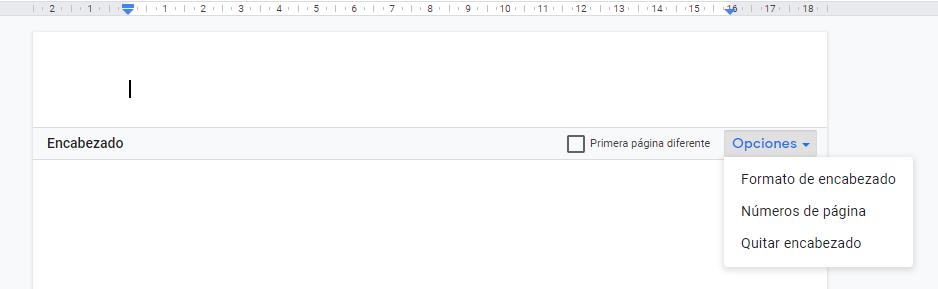{ width="500" }
  <figcaption></figcaption>
</figure>

Nos aparecen varias opciones relacionadas con el encabezado:

- **Primer página diferente**: No incluye el encabezado en la primer página, por si añadimos una portada o un índice.

- **Formato de encabezado**: Nos permite definir las dimensiones de los márgenes del encabezado y elegir un encabezado distinto para página pares e impares.

- **Números de página**: Con esta opción podemos añadir un número de página en el encabezado. El número de página se incrementa automáticamente.

- **Quitar encabezado**: Deja el encabezado en blanco.


#### Pie de página

Los pie de página son palabras o frases que aparecen en todas las páginas del documento, se emplea mucho para añadir el número de página.

Para activar el pie de página, hacemos doble clic en el margen inferior del documento, entonces podremos escribir en el pie de página.

<figure markdown>
  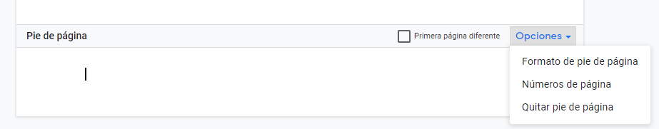{ width="500" }
  <figcaption></figcaption>
</figure>

El pie de página tiene exactamente las mismas opciones que el encabezado, por lo que no vamos a repetir su explicación. Para dejar de editar el pie de página o el encabezado, hay que hacer clic dentro del área de edición del documento.


#### Columnas

Google Docs permite escribir más de una columna por página, para ello hay que entrar en el menú Formato -> Columnas y elegimos la cantidad de columnas.

<figure markdown>
  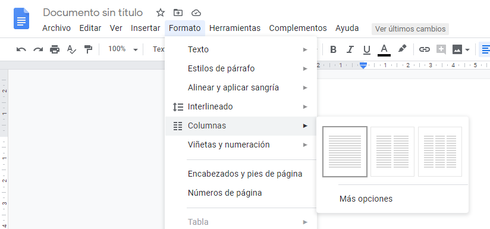{ width="500" }
  <figcaption></figcaption>
</figure>


Si pulsamos en Más opciones; podremos ajustar la distancia entre columnas y podremos insertar líneas verticales entre las columnas.

A veces es útil insertar una línea horizontal en un documento para separar secciones, para hacerlo, hay que elegir la opción **Insertar -> Línea horizontal.**


### Tablas

A veces, en un texto, hay que recoger datos que pueden organizarse y presentarse en forma de tablas. Google Docs permite insertar tablas de cualquier número de celdas (Cada uno de los cuadros de la tabla ) y modificarlas libremente. Hay en el menú una opción llamada Tabla, donde se recogen todas las operaciones que podemos realizar relacionadas con las tablas.

Para insertar una tabla en un documento, situamos el cursor en el sitio adecuado y elegimos la opción Insertar -> Tabla del menú . Entonces elegimos con el ratón la dimensión de la tabla señalando las columnas y filas correspondientes (4 columnas y 3 filas en el ejemplo siguiente):

<figure markdown>
  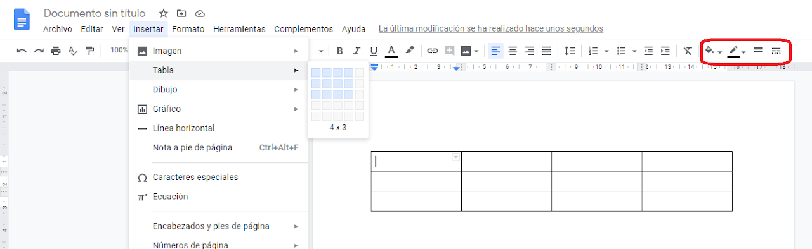{ width="800" }
  <figcaption></figcaption>
</figure>

Nos aparece la tabla vacía con todas las celdas en blanco y además aparecen nuevos iconos en la barra de herramientas que sirven para rellenar la celda o celdas seleccionadas de algún color y para modificar el color, grosor y tipo de línea del borde de las celdas.

Si pulsamos en cualquiera de las celdas de la tabla se activa la opción Formato -> Tabla, (que normalmente está desactivada), lo que hace que se muestre un menú con bastantes opciones de operaciones sobre la tabla:

- Insertar filas o columnas.
- Eliminar filas o columnas (o la tabla entera)
- Distribuir las filas o columnas para que midan lo mismo.
- Combinar o separar celdas.

<figure markdown>
  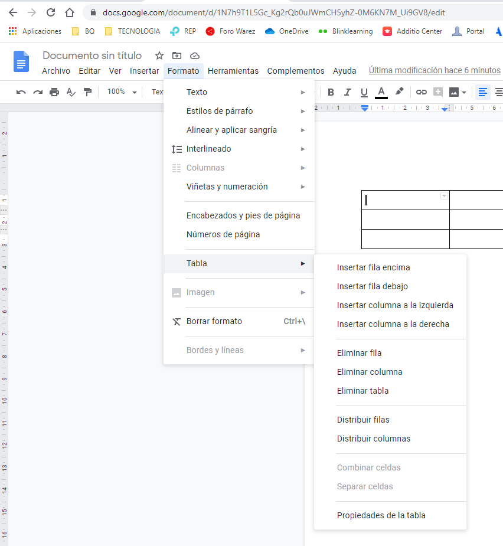{ width="800" }
  <figcaption></figcaption>
</figure>

Además podemos acceder a las Propiedades de tabla, con las que podremos configurar otras cosas como la alineación vertical, las dimensiones exactas de cada celda, la sangría de los textos dentro de las celdas, la alineación de la tabla dentro del párrafo, etc.

<figure markdown>
  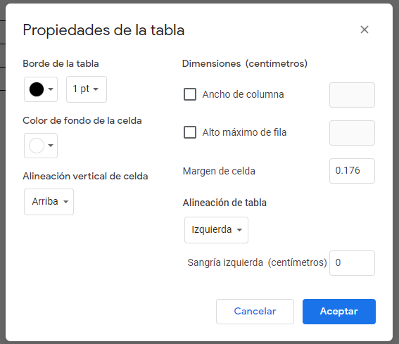{ width="800" }
  <figcaption></figcaption>
</figure>

#### Índices

En todos los documentos largos es conveniente incluir un índice que nos indique la página donde se encuentra cada título y subtítulo.

Google Docs es capaz de generar un índice automáticamente, para ello, ponemos el cursor en la parte del documento en la que queremos insertar el índice y elegimos del menú **Insertar -> Índice**, entonces nos aparecerá una ventana como la siguiente en la que podemos elegir insertar un índice con números o insertar un índice con enlaces azules que te llevan directamente a la página donde se encuentra el título pulsado:

<figure markdown>
  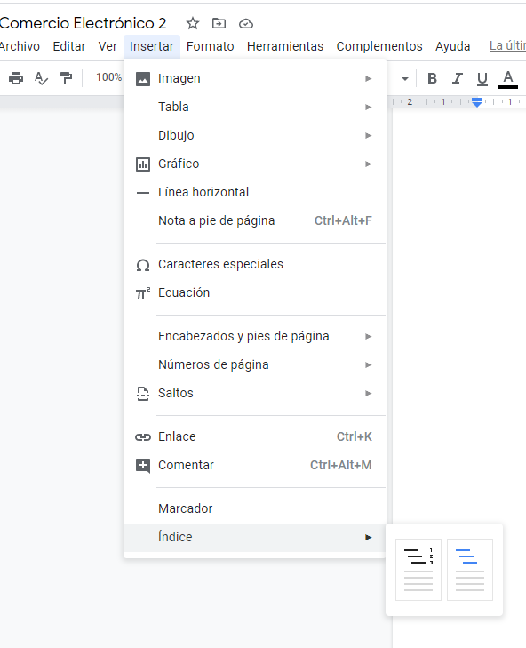{ width="600" }
  <figcaption></figcaption>
</figure>

Al insertar el índice, nos aparece una línea como la siguiente en el lugar donde teníamos el cursor y tal y como dice, hay que ir añadiendo encabezados (los títulos del documento) que están en la opción Formato -> Estilos de párrafo.

A los títulos de primer nivel (Los que solo tienen un número), los marcaremos con el Estilo de párrafo Título 1

A los títulos de segundo nivel (Los que tienen dos números), los marcaremos con el Estilo de párrafo Título , y así sucesivamente.

<figure markdown>
  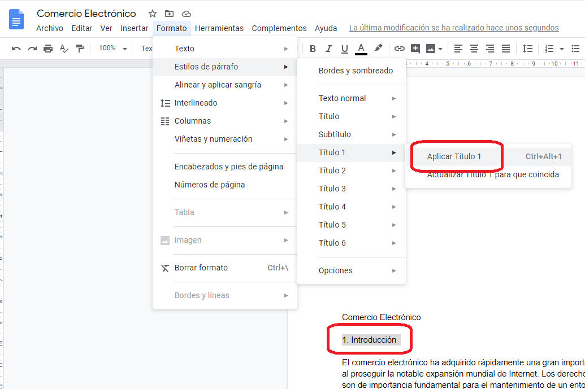{ width="600" }
  <figcaption></figcaption>
</figure>

!!! INFO "Muy importante"
	Cada vez que añadimos títulos a nuestro documento, hay que pulsar el botón de la izquierda en forma de flecha circular, para que se actualice el indice.

### WordArt

Con WordArt podemos hacer títulos vistosos, con letras grandes de colores, para insertar un título con WordArt hay que abrir el editor de dibujo (que ya veremos en la próxima clase), para ello hay que elegir la opción **Insertar -> Dibujo -> + Nuevo**, con lo que accedemos al editor de dibujo.

<figure markdown>
  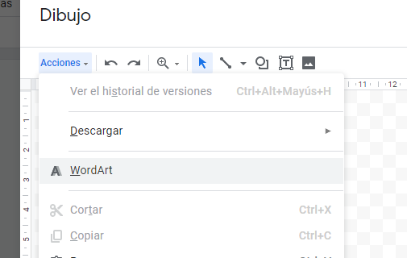{ width="600" }
  <figcaption></figcaption>
</figure>

En dicho editor de dibujo, elegimos **Acciones -> WordArt**, con lo que se nos mostrará un cuadro de diálogo para escribir el título que queramos.

Con los botones de la barra de herramientas del editor, es fácil modificar el tipo de letra, el color de relleno y de línea, el grosor, el ángulo, etc.

<figure markdown>
  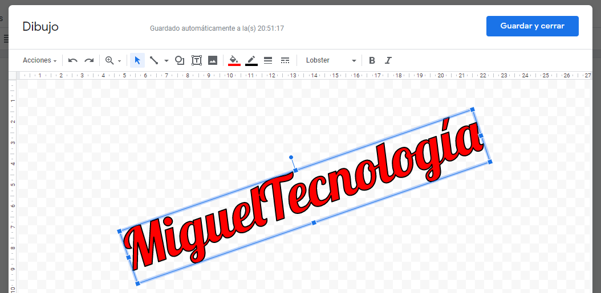{ width="600" }
  <figcaption></figcaption>
</figure>

Una vez terminado nuestro WordArt, pulsamos el botón Guardar y cerrar para insertarlo en nuestro documento. Se puede cambiar un WordArt ya insertado en el documento haciendo doble clic sobre él.


### Dibujos

Ya vimos en la clase anterior cómo acceder al editor de dibujos, para ello hay que elegir la opción **Insertar -> Dibujo -> + Nuevo**, con lo que accedemos al editor de dibujo.

<figure markdown>
  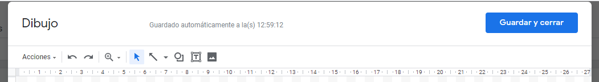{ width="600" }
  <figcaption></figcaption>
</figure>

El editor de dibujo consta de una hoja transparente donde podemos insertar varios objetos que son accesibles a través de los iconos de la barra de herramientas de dibujo. (Cuando insertamos y seleccionamos un objeto, aparecen más iconos a la derecha para realizar distintas operaciones sobre el objeto seleccionado).

Si elegimos la opción Acciones -> Descargar, podremos descargar un documento PDF o una imagen para añadir al fondo de nuestro dibujo y podremos dibujar y añadir objetos encima de la misma.

También podemos acceder a WordArt.

Además, a través de este menú podemos alinear, distribuir o girar los objetos insertados y podemos agrupar y desagrupar objetos.

Los objetos se clasifican en capas a medida que los vamos insertando, la opción ordenar nos permite modificar el orden de las capas.

<figure markdown>
  { width="600" }
  <figcaption></figcaption>
</figure>

En el menú de Líneas, tenemos a nuestra disposición una gran cantidad de tipos de línea, rectas, curvas, a mano alzada, con flechas, etc.

Al insertar una línea nos aparecen varios iconos más que nos permiten cambiar el color, grosor y tipo de línea.

<figure markdown>
  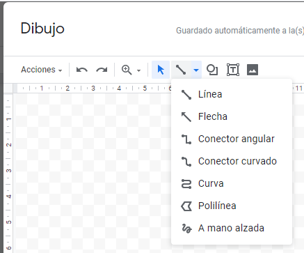{ width="600" }
  <figcaption></figcaption>
</figure>

En el menú de Formas tenemos gran cantidad de formas clasificadas en cuatro grupos, dichas formas pueden ser redimensionadas, coloreadas, se les puede cambiar el tipo de borde y se puede escribir dentro de ellas (haciendo doble clic en la misma).

Las formas son muy útiles para hacer esquemas e insertarlos en nuestros trabajos.

<figure markdown>
  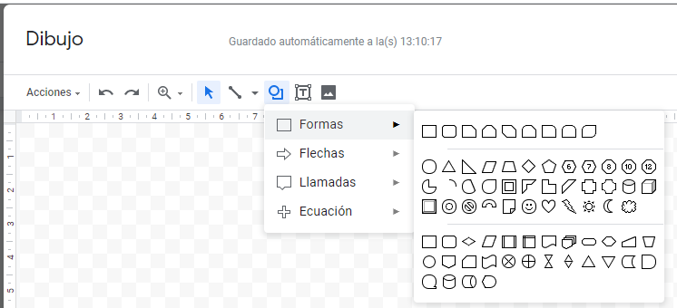{ width="600" }
  <figcaption></figcaption>
</figure>

Por último tenemos la opción de insertar un cuadro de texto en el que podemos escribir, al insertar un cuadro de texto nos aparecen los iconos de edición de texto para que podamos cambiar las propiedades del texto y además los iconos de Forma que nos permite cambiar el color del cuadro de texto y del borde. (Se puede configurar un cuadro de texto con fondo transparente y sin borde, para insertar solo texto).

<figure markdown>
  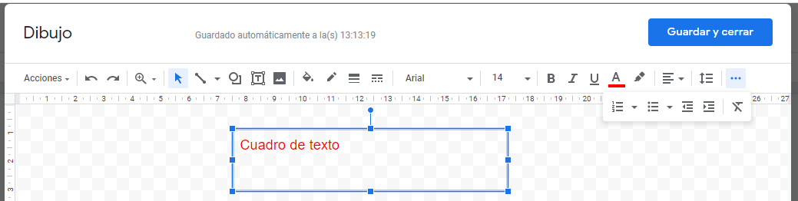{ width="600" }
  <figcaption></figcaption>
</figure>

!!! INFO
	Si pulsamos con el botón derecho sobre el fondo, podemos cambiar el color del fondo, pudiendo añadir colores degradados. La alineación del dibujo dentro del documento se realiza igual que las imágenes insertadas.


### Gráficos

Una forma sencilla y visual de presentar la información en nuestros documentos es mediante gráficos. Los gráficos los estudiaremos con más profundidad en el Tema 4: La hoja de cálculo, ahora nos limitaremos a realizar un ejercicio paso a paso para comprobar lo fácil que resulta incluir un gráfico en un documento.

Sigue los pasos en un documento de Google Docs en blanco:

|Vamos a hacer un gráfico parecido a este|Elegimos Insertar -> Gráfico -> Circular|
|-|-|
|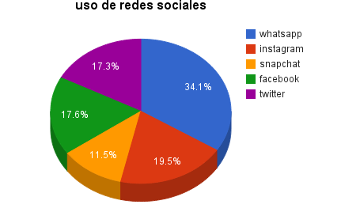|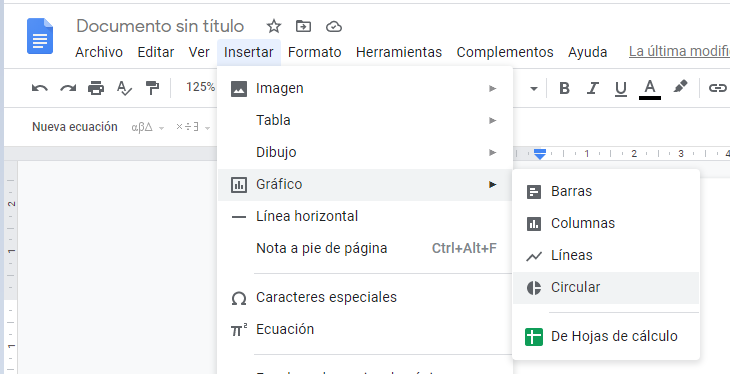|

|Se crea un gráfico como este -> Abrimos el menú que hay arriba a la derecha del gráfico -> Elegimos Abrir origen | Se abre una hoja de cálculo con nuestro gráfico y la tabla de datos, que tendremos que cambiar con los datos correspondientes. (Hay que añadir una fila más) -> Si hacemos doble clic en el título Points scored lo podremos cambiar|
|-|-|
|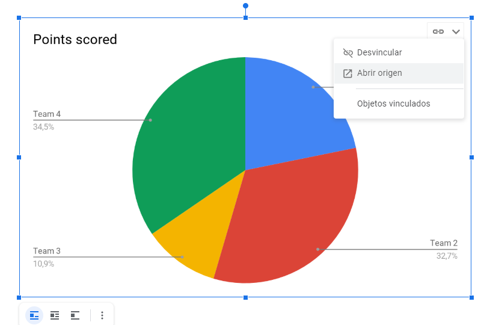|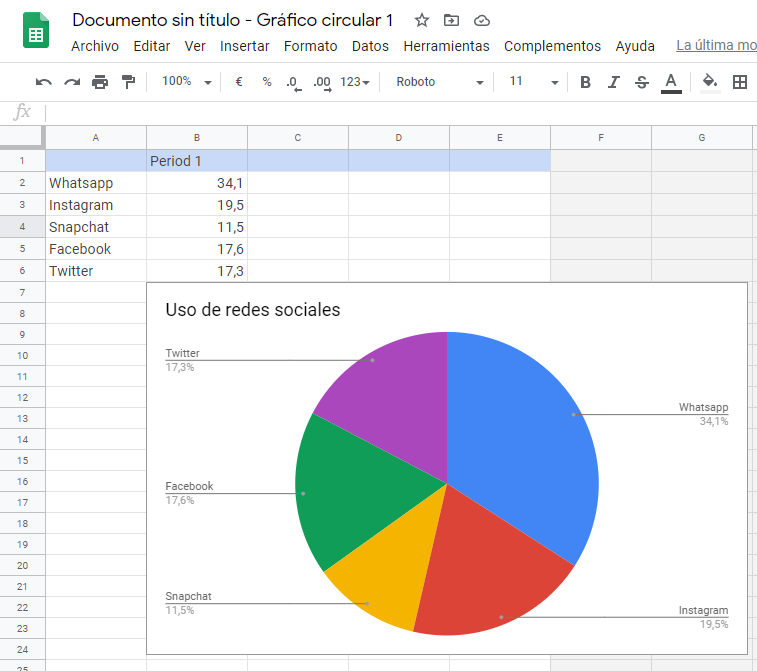|


|Volvemos a nuestro documento y pulsamos en el botón ACTUALIZAR|Ya tenemos el gráfico en nuestro documento con los datos correspondientes.|
|-|-|
|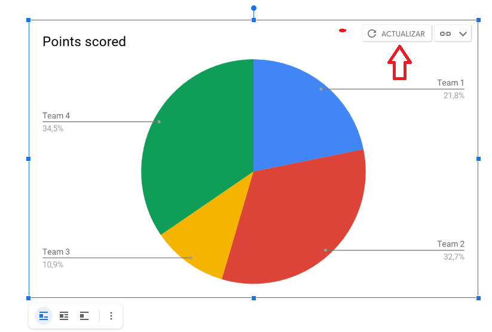|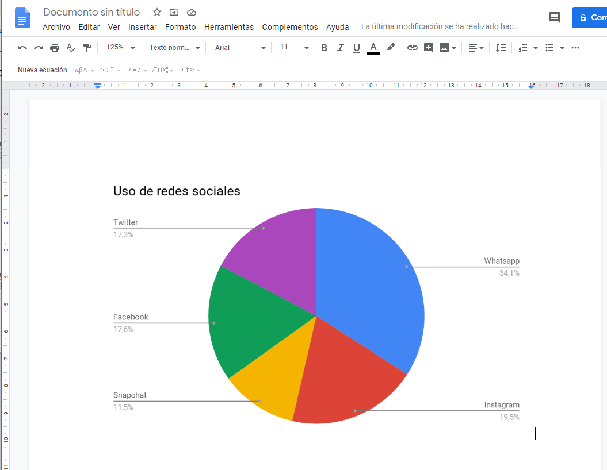|


### Insertando fórmulas

En ocasiones necesitamos escribir una fórmula o una expresión matemática y no suele quedar bien utilizando los caracteres normales. Google Docs dispone de un editor de fórmulas o ecuaciones ejecutando la opción Insertar -> Ecuación, nos aparece la barra de herramientas de ecuaciones que aunque parece simple, nos permite escribir cualquier tipo de expresión matemática.

También podemos hacer visible la barra de herramientas de ecuaciones con la opción Ver -> Mostrar la barra de herramientas de ecuaciones del menú.


|Menu Insertar -> Ecuación|Listado de fórmulas|
|-|-|
|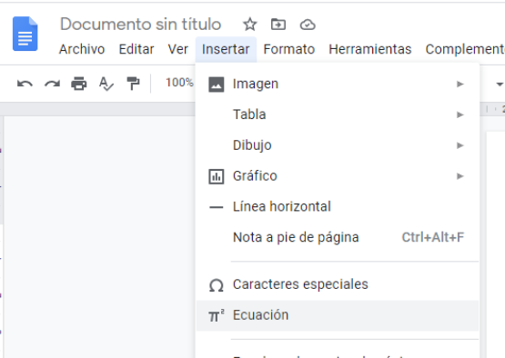|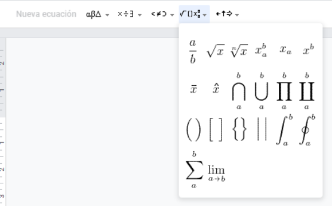|


---


## 🧰 EJERCICIOS

1.- ❎ Elige el editor de **mark down** que quieras (Visual Studio code o Typora) y maqueta el siguiente documento eligiendo la temática que prefieras, exporta el documento a **PDF** y súbelo a **Aules**:

    - Una imagen de cabecera que ocupe todo el ancho de la página
    - Un título 1 que describa el documento
    - Un párrafo resumen con al menos 200 palabras que describa lo que se está viendo
    - Una tabla,de al menos 4 columnas, con información detallada
    - Una lista numerada, de al menos 5 elementos, con información extra del documento
    - Un último bloque con al menos una noticia de actualidad

!!! WARNING "Temática"
    Los temas propuestos para el ejercicio han sido los siguientes:

    - Info y resultados del mundial de fútbol **Qatar 2022**
    - Liga **CS:GO**
    - **Pokémon**
    - **Anime** con info sobre actores y actrices de doblaje y sus personajes
    - Universo **Hollow Knight**

Tienes un ejemplo en [este enlace](media/hk.pdf)

---

2.- ❎ En el ejercicio anterior, crea un archivo **.md** por cada uno de los elementos de la lista numerada, pero sólo de los 5 primeros. En cada uno de estos nuevos archivos debe aparecer la información correspondiente al nombre. Después, crea un menú a partir de una tabla con estos 5 elementos que contengan, cada uno, un enlace al correspondiente archivo **.html** que exportarás desde los nuevos **.md** que has creado.

Por último, en cada uno de los nuevos **.md** creados (máximo 5) debes añadir un enlace para que vaya al inicio (el primer **.md** creado).

!!! ERROR "Cuidado"
    Nombra bien los archivos html que exportes y acuérdate ya que los necesitas para crear los enlaces. Por otro lado, **DEBES RECORDAR** exportar a **.html** el primer **.md** creado en el ejercicio 1 para que exista ese enlace.

---

3.- ¿Qué es una suite ofimática y qué programas suele tener? Busca en Internet otras suites ofimáticas aparte de las vistas en el tema.

---

4.- ¿Qué se puede hacer con un procesador de texto moderno?.  Abre el procesador de textos Google Docs. Dibuja la ventana que aparece y señala sus partes principales.

---

5.- Escribe las opciones principales de la barra de herramienas de Google Docs.

---

6.- Explica qué es Google Drive, sus principales características y de qué manera se enlaza con la _suite de Google Docs_

---

7.- Describe los tres métodos empleados para abrir un documento de Google Docs. ¿Qué opciones tenemos a la hora de abrir documentos en Google Docs? ¿En qué formatos de texto puede guardar los documentos Google Docs? ¿Por qué se utiliza tanto el formado de texto PDF en el tráfico de documentos por Internet?

---

8.- Abre Google Docs, crea un documento de texto nuevo y escribe una pequeña frase. Envía el archivo por correo electrónico a tu profesor en formato PDF, como asunto escribe "Ejercicio de Google Docs" y como mensaje escribe tu nombre, apellidos y clase.

---

9.- Elabora un documento en en Google Docs que recoja los atajos de teclado más importantes a la hora de editar o crear un documento de texto. Como mínimo tiene que haber 20 elementos diferentes y que sean los más importantes o más usados tales como seleccionar una palabra, una línea entera, poner negrita, cursiva o subrayado, seleccionar todo el texto del documento, crear un salto de página entre otros.

---

10.- Crea un documento de Google Docs que tenga las siguientes características:

		Tamaño del papel:
			Alto: 10,50 cm
			Ancho: 20,50 cm
		
		Márgenes:
			Derecha e izquierda de 1,00 cm
			Arriba y abajo de 2,00 cm

		Orientación el papel: Vertical

		Escribe a continuación tres párrafos alineados uno a la izquierda, otro a la derecha y otro en el centro.
		
		Después realiza una lista numerada de cinco palabras.
		
		Para terminar, realiza otra lista de otras cinco palabras con viñetas.

---

11.- Crea un docuemtno en Google Docs con el siguiente texto y formatealo de tal forma que quede como en la imagen de abajo.

```
Federico García Lorca
Nació en el municipio de Fuente Vaqueros, Granada (España), en el seno de una familia de posición económica desahogada, el 5 de junio de 1898, y fue bautizado con el nombre de Federico del Sagrado Corazón de Jesús García Lorca; su padre fue Federico García Rodríguez (1859-1945), un hacendado, y su madre, Vicenta Lorca Romero (1870-1959) fue la segunda esposa de su padre, maestra de escuela que fomentó el gusto literario de su hijo.
Desde los 2 años, según uno de sus biógrafos, Edwin Honig, Federico García Lorca mostró su habilidad para aprender canciones populares, y a muy corta edad escenificaba en miniatura oficios religiosos. Su salud fue frágil y no empezó a caminar hasta los cuatro años. Leyó en su casa la obra de Víctor Hugo y de Miguel de Cervantes. Como estudiante fue algo irregular. De niño lo pusieron bajo la tutela del maestro Rodríguez Espinosa, en Almería, ciudad en la que residió con su familia entre 1906 y 1909. Inició el bachillerato de vuelta a su provincia natal y abandonó la Facultad de Derecho de Granada para instalarse en la Residencia de Estudiantes de Madrid (1918–1928); pasado un tiempo, regresó a la Universidad de Granada, donde se licenció en Derecho, aunque nunca ejerció la abogacía, puesto que su vocación era la literatura.
El olivo donde fue fusilado.
La ubicación meridional de Granada, donde se encontraba viva la herencia mora, el folclore, el oriente y una geografía agreste, quedó impresa en toda su obra poética, donde los romanceros y la épica se funden de manera perceptible. Después de su madre, fue Fernando de los Ríos quien estimuló el talento del entonces pianista en favor de la poesía; así, en 1917 escribió su primer artículo sobre José Zorrilla, en su aniversario.
La España de García Lorca era la de la Edad de Plata, heredera de la Generación del 98, con una rica vida intelectual donde los nombres de Francisco Giner de los Ríos, Benito Pérez Galdós, Miguel de Unamuno y, poco después, Salvador de Madariaga y José Ortega y Gasset imprimían el sello distintivo de una crítica contra la realidad de España.
Influyeron, además, en la sensibilidad del poeta en formación Lope de Vega, Juan Ramón Jiménez, Antonio Machado, Manuel Machado, Ramón del Valle-Inclán, Azorín y el Cancionero popular.
```

<figure markdown>
  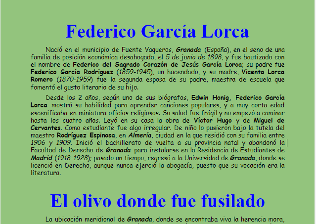{ width="800" }
  <figcaption></figcaption>
</figure>

---

12.- Vamos a realizar una portada para el texto de la clase anterior en una página nueva de Google Docs tal y como sale en el siguiente ejemplo:

		- Modifica el color de la página y reduce todos los márgenes a 1 cm.
		- Inserta cuatro imágenes de Fde lo que quieras desde el buscador en Google Docs.
		- Añade un borde a las imágenes y modifica su tamaño y rotación
		- Recolorea las imágenes y retoca los ajustes de las mismas.
		- Añade el título y los nombres de los autores a la portada.

<figure markdown>
  { width="400" }
  <figcaption></figcaption>
</figure>

---

13.- Imagina que eres el maquetador del periódico "Diario del IES Carrús" y que te pasan la siguiente noticia para que tú le des formato al texto. Abre el documento de la izquierda Google Docs pulsando sobre el mismo y modifícalo según las indicaciones de abajo para darle la apariencia de un periódico:

		- Ponle al título un formato adecuado.
		- Distribuye el texto en dos columnas separadas por un espacio de 1 cm y una línea
		- Aplica una alineación justificada a todo el texto y cambia el tipo de letra a Times New Roman.
		- Separa los párrafos e incluye una sangría de 1 cm. en la primera línea de cada uno de ellos.
		- Busca en Internet dos fotos alusivas al tema e insértalas en el texto.
		- Incluye un encabezamiento con el nombre del periódico y una línea debajo del mismo.
		- Incluye un pie de página con el número de página centrado y una línea encima del mismo.

|Texto original|Resultado Final|
|-|-|
|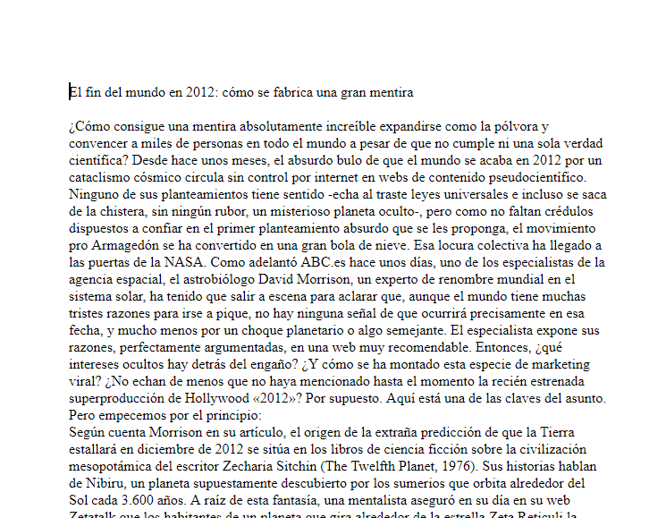|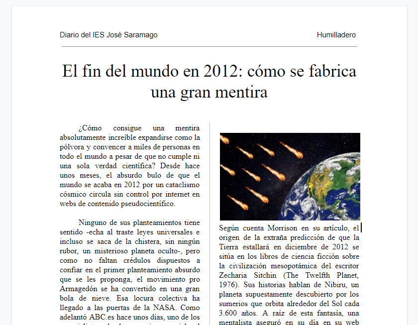|

---

14.- Crea un documento nuevo en Google Docs y realiza las siguientes actividades:

<figure markdown>
  { width="400" }
  <figcaption></figcaption>
</figure>


		- Inserta una tabla de 8 columnas y 5 filas.
		- Elimina 2 columnas e inserta 3 filas más.
		- Escribe las horas y los días de la semana, como en el ejemplo.
		- Aumenta el tamaño de la columna de las horas para que se vean en una sola línea y distribuye uniformemente las demás columnas.
		- Combina las celdas centrales como en el ejemplo de la derecha, para escribir la palabra RECREO.
		- Centra el texto de cada celda tanto horizontal, como verticalmente.
		- Realiza tu horario de clase en la tabla, coloreando las celdas de distintos colores según la asignatura.

---

15.- Métete en Wikipedia y copia cualquier texto que te parezca interesante. A continuaciçon dale el formato adecuado según las siguientes instrucciones:

		- Realiza una portada con el título hecho con WordArt, una foto sobre el tema y los nombres de los autores.
		- Justifica todo el texto.
		- Inserta el título Comercio electrónico en el encabezado, alineado a la izquierda, pero que no aparezca en la portada.
		- Inserta el número de página centrado en el pie de página.
		- Selecciona cada título y aplica el estilo de párrafo correspondiente a cada uno.
		- Incluye indice tras la portada.

---

16.- Utiliza el editor de dibujo de Google Docs para realizar tres carteles, insertando formas y dibujos o fotos de Internet.

		- Un cartel para tu fiesta de cumpleaños.
		- Un cartel para vender tu móvil usado.
		- Un cartel para el día de los enamorados.
		- Utiliza el formato de página apaisado y procura que sean atractivos y elaborados.

---